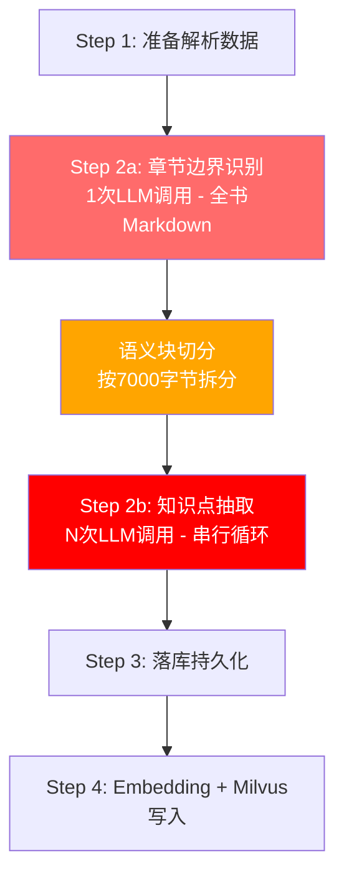
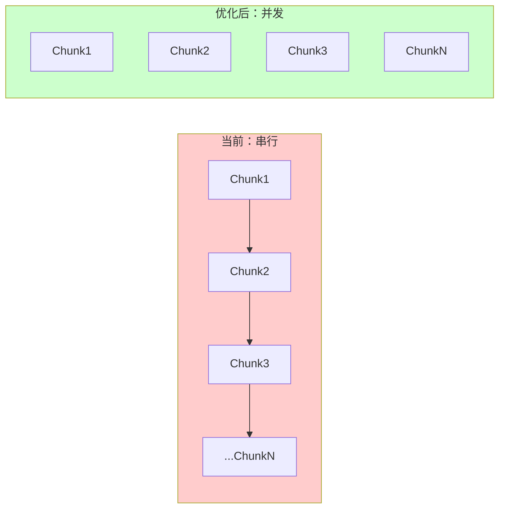

# "重组教学内容"耗时分析与优化方案

## 一、耗时根因分析

"重组教学内容"对应后端的 `knowledge_extract` 任务，核心实现在 [`backend/app/modules/knowledge/tasks.py`](backend/app/modules/knowledge/tasks.py) 的 `run_extract_task` 函数中。

### 执行流程总览



### 根因 1（致命瓶颈）：N 次 LLM 调用完全串行

```137:183:backend/app/modules/knowledge/tasks.py
        point_drafts = []
        chapter_summaries: list[dict] = []
        for chunk_index, semantic_chunk_draft in enumerate(semantic_chunk_drafts, start=1):
            # ... 每个chunk一次LLM调用，完全串行等待
            point_result = llm_service.generate_structured_output(
                messages=_build_chapter_point_extraction_messages(...),
                response_model=KnowledgeChapterPointExtractionResult,
            )
            # ... 处理结果
```

- 一本 130 页、10 章教材，按 7000 字节拆块后产生约 **15-25 个语义块**
- 每个语义块触发 1 次 LLM 调用，加上首次边界识别，总计 **16-26 次 LLM 请求**
- 单次 LLM 调用耗时：正常 15-45 秒（结构化输出 + 流式传输）
- **串行总耗时：4-20 分钟**（仅 LLM 部分）

### 根因 2：单次 LLM 调用的最坏情况放大

每次 `generate_structured_output` 内部有 3 层重试机制叠加：

| 层级 | 机制 | 最大次数 | 配置项 |
|------|------|----------|--------|
| 传输层 | HTTP 429/5xx/超时重试 | 2 次 | `llm_max_retries=2` |
| 缺文本层 | 返回空文本时重发 | 2 次 | 同上 |
| JSON修复层 | 解析/校验失败时回调 LLM 修复 | 2 次 | `llm_parse_repair_max_attempts=2` |

最坏情况下，单次逻辑调用可能产生 **5 次实际 HTTP 请求**：
- 首次调用超时重试 2 次 -> 缺文本重试 -> JSON 修复 2 次
- 单次逻辑调用最坏耗时：60s x 5 = **300 秒（5 分钟）**

### 根因 3：首次边界识别输入整本书 Markdown

```105:108:backend/app/modules/knowledge/tasks.py
        boundary_result = llm_service.generate_structured_output(
            messages=_build_chapter_boundary_messages(parse_version=parse_version, line_index=line_index),
            response_model=KnowledgeChapterBoundaryResult,
        )
```

- `line_index.numbered_text` 包含全书带行号的 Markdown（130 页可达 10-20 万字符）
- 输入 token 数极大，LLM 推理时间长（可能 30-90 秒）
- 输出 token 多（需要列出所有一级章节）

### 根因 4：7000 字节拆块策略过于保守

```30:30:backend/app/modules/knowledge/domain.py
SEMANTIC_CHUNK_TARGET_MAX_UTF8_BYTES = 7000
```

- 7000 UTF-8 字节约等于 2300 个中文字符，对于 LLM 上下文窗口来说非常保守
- 一个 15 页的章节（约 7000-10000 字）会被拆成 **3-4 个语义块**
- 块越多 -> LLM 调用次数线性增长

### 根因 5：Embedding + Milvus 串行写入

向量写入阶段先调用 Embedding API 再写 Milvus，两个集合分开处理，无并行。

### 耗时估算（130 页教材典型场景）

| 阶段 | 估算耗时 | 占比 |
|------|----------|------|
| 准备解析数据 | 1-3s | <1% |
| 章节边界识别（1次LLM） | 30-90s | 10-15% |
| 语义块切分 | <1s | <1% |
| 知识点抽取（~20次LLM串行） | **5-15min** | **70-85%** |
| 落库持久化 | 3-10s | 1-2% |
| Embedding + Milvus | 15-60s | 5-10% |
| **总计** | **7-20 分钟** | |

---

## 二、最优优化方案

### 方案核心：并发 LLM 调用 + 增大块尺寸 + Prompt Cache



### 优化 1（收益最大）：语义块 LLM 调用并发化

将 `tasks.py` 中第 137-182 行的串行循环改为**受控并发**：

```python
import asyncio
from concurrent.futures import ThreadPoolExecutor

MAX_LLM_CONCURRENCY = 5  # 可配置，避免触发 rate limit

async def _extract_points_concurrent(
    semantic_chunk_drafts, chapter_drafts, llm_service, ...
):
    semaphore = asyncio.Semaphore(MAX_LLM_CONCURRENCY)
    
    async def process_chunk(chunk_index, semantic_chunk_draft):
        async with semaphore:
            # 在线程池中执行同步 LLM 调用
            point_result = await asyncio.to_thread(
                llm_service.generate_structured_output,
                messages=_build_chapter_point_extraction_messages(...),
                response_model=KnowledgeChapterPointExtractionResult,
            )
            return chunk_index, point_result
    
    tasks = [
        process_chunk(i, chunk) 
        for i, chunk in enumerate(semantic_chunk_drafts, start=1)
    ]
    results = await asyncio.gather(*tasks, return_exceptions=True)
    return results
```

**预期收益**：20 个语义块、并发度 5 -> 耗时降为原来的 1/5，从 10 分钟降至约 **2 分钟**。

### 优化 2：增大语义块尺寸

```python
# 当前
SEMANTIC_CHUNK_TARGET_MAX_UTF8_BYTES = 7000   # ~2300 中文字

# 优化后（配合 128K context window 模型）
SEMANTIC_CHUNK_TARGET_MAX_UTF8_BYTES = 20000  # ~6600 中文字
```

**预期收益**：语义块数量减少 60-70%（20 块 -> 7-8 块），LLM 调用次数同比下降。

### 优化 3：利用 Prompt Cache 降低单次耗时

当前代码已有 `cache_biz_key` 和 `stable_prefix_message_count` 参数但未在知识抽取中使用：

```python
point_result = llm_service.generate_structured_output(
    messages=_build_chapter_point_extraction_messages(...),
    response_model=KnowledgeChapterPointExtractionResult,
    cache_biz_key=f"knowledge_extract_{parse_version.id}",
    stable_prefix_message_count=1,  # system prompt 固定
)
```

同一教材的所有语义块共享相同的 system prompt，OpenAI/Anthropic 的 Prompt Cache 可将前缀 token 计费和延迟减半。

### 优化 4：章节边界识别分页策略

对超长教材，将全书 Markdown 按目录结构或固定页数分段送入 LLM，分多次识别后合并：

- 每次送入 30-50 页（控制在 30K token 以内）
- 并行调用，最后合并去重
- 首次 LLM 从 60-90s 降至 **15-20s x 并行**

### 优化 5：Embedding 批量并行

将语义块和知识点的 Embedding 请求拆成多个小批次并发发送，而非单次大批量。

### 综合优化后耗时估算

| 阶段 | 优化前 | 优化后 | 降幅 |
|------|--------|--------|------|
| 章节边界识别 | 30-90s | 15-25s | -60% |
| 知识点抽取 | 5-15min | **50-120s** | -85% |
| Embedding + Milvus | 15-60s | 8-20s | -50% |
| **总计** | 7-20min | **1.5-3min** | -80%+ |

---

## 三、实施优先级

| 优先级 | 优化项 | 改动范围 | 预期收益 |
|--------|--------|----------|----------|
| P0 | 语义块 LLM 并发化 | `tasks.py` 循环改并发 | 耗时降 70-85% |
| P1 | 增大语义块尺寸 | `domain.py` 常量 + 可配置化 | 减少 60% 调用次数 |
| P2 | 启用 Prompt Cache | `tasks.py` 加 cache 参数 | 单次延迟降 30-50% |
| P3 | 章节边界识别分页 | `tasks.py` 边界识别逻辑 | 首次调用降 60% |
| P4 | Embedding 并行化 | `service.py` 向量写入 | 末尾阶段降 50% |

---

## 四、关键文件

- [`backend/app/modules/knowledge/tasks.py`](backend/app/modules/knowledge/tasks.py) — 主流程，需改造串行循环为并发
- [`backend/app/modules/knowledge/domain.py`](backend/app/modules/knowledge/domain.py) — 语义块切分，需调整尺寸阈值
- [`backend/app/shared/llm/service.py`](backend/app/shared/llm/service.py) — LLM 服务，需支持异步调用
- [`backend/app/core/config.py`](backend/app/core/config.py) — 配置项，需新增并发度控制
