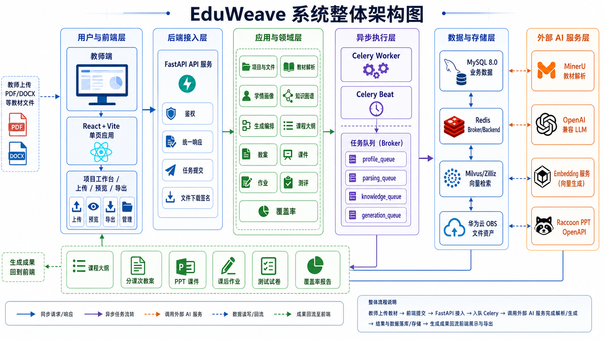

<!-- @Date: 2026-05-30 @Author: xisy @Discription: EduWeave 项目根说明文档 -->

# EduWeave

EduWeave 是一套「教材到课堂」的全链路 AI 教学资源重构系统。它把「教材 PDF + 班级学情分析文件」这类原始素材，自动转化为可直接进课堂的标准化教学成果——课程大纲、分课次教案、PPT 课件、课后作业与单元/期末试卷，并附带知识点覆盖率分析，形成可复用、可扩展、可追溯的智能教学资源生产体系。

系统面向赛题「基于 MinerU 的教材到课堂全链路 AI 教学资源重构」，以单角色（教师）贯穿全流程，采用前后端分离架构：后端基于 FastAPI 对外提供 RESTful 接口，前端是基于 Vite 构建的 React 单页应用。

## 核心能力

EduWeave 把传统上耗时、割裂、依赖人工的资源生产过程，收敛为一条贯通的七步生产闭环：上传、解析、结构化、规划、生成、校验、交付。每一步都以「版本」为单位沉淀，前一步的可用版本是后一步的输入基线，从而保证全链路可追溯、可重跑。

- 教材多版本与解析复核：PDF 上传与多版本共存、MinerU 高保真解析、页级证据浏览、异常列表、页级局部重解析与人工修正、解析确认。
- 班级学情聚合画像：按班级上传多名学生 DOCX，本地解析个体画像后由 LLM 聚合为班级画像（共同难点、学习风格分布、目标分层与教学建议），支持人工修正。
- 知识图谱编辑：章节树与知识点浏览、证据回溯、补丁式人工修正与版本管理；知识点与语义块写入 Milvus 承载语义检索。
- 一键生成：从解析到成果物的跨阶段自动编排，支持「是否自动确认解析」、课次数量、课时时长等参数。
- 成果物生成与管理：课程大纲、分课次教案、PPT 课件（Raccoon PPT）、课后作业、单元/期末试卷、覆盖率报告，均支持查询、预览与按需触发。
- 任务中心：任务列表、步骤级进度、失败归因与课次级断点续跑。
- 导出与下载：课程大纲、教案、试卷等支持 Word 导出，文件统一通过华为云 OBS 签名地址下载。
- 备课智能助手：项目级对话式助手，可按自然语言迭代精修课程大纲与分课次教案（以新建版本沉淀），做教材混合检索问答，并以时间线透明展示工具调用过程；提供教案页悬浮抽屉与独立助手页两种形态。

## 系统架构

后端遵循「版本优先、异步优先、结构化优先」的设计原则，划分为接入层、应用层、领域持久层、基础设施层与异步执行层五个逻辑层。运行时由三类应用进程与多类中间件协同：

- 应用进程：API 服务（处理 HTTP 请求，并在进程内托管智能助手 worker 线程池）、Celery worker（执行解析、抽取、生成、分析等异步任务）、Celery beat（调度僵尸任务回收与课件远程状态复查等周期任务）。
- 数据与中间件：MySQL 8.0（业务数据中心）、Redis（Celery broker/backend）、Milvus/Zilliz（向量检索中心）、华为云 OBS（文件资产中心）。
- 外部 AI 服务：MinerU（教材高保真解析）、OpenAI 兼容 LLM（结构化生成）、独立 Embedding 服务（向量化）、Raccoon PPT OpenAPI（课件排版生成）。

系统按三阶段推进，阶段间通过数据库实体的版本链严格串联血缘，并由 `generation_batch` 在生成阶段冻结输入基线，保证多成果物同源一致：

```
教材版本 textbook_version
   └─ 解析版本 parse_version（父链支持局部重解析）
        └─ 知识版本 knowledge_version（章节树 + 知识点 + 语义块 + 向量）
             └─ 生成批次 generation_batch（冻结基线 + 章节范围 + 课次/测评策略）
                  ├─ 课程大纲 curriculum_plan
                  │    └─ 教案 lesson_plan（多课次）
                  │         ├─ 课件 courseware_result（Raccoon PPT）
                  │         └─ 课后作业 homework_result → homework_question
                  ├─ 测评蓝图 assessment_blueprint → 试卷 paper_result → 题目 question_item
                  └─ 覆盖率报告 coverage_report
学情版本 learner_profile_version（班级多学生聚合）→ 被 generation_batch 冻结
```



更完整的设计与关键技术实现路径见 [技术解决方案](docs/技术解决方案.md)。

## 技术栈

| 端 | 技术 |
| --- | --- |
| 后端 | Python 3.12、FastAPI、SQLAlchemy 2、Alembic、Celery + Redis、Pydantic v2、PyMilvus、华为云 OBS SDK、PyMuPDF / python-docx |
| 前端 | React 18、TypeScript 5、Vite 6、React Router v7、TanStack Query v5、Zustand、Tailwind CSS 3、lucide-react、gsap |
| 数据与中间件 | MySQL 8.0、Redis、Milvus/Zilliz、华为云 OBS |
| 外部 AI 服务 | MinerU、OpenAI 兼容 LLM、独立 Embedding 服务、Raccoon PPT OpenAPI |

## 目录结构

```
EduWeave/
├── backend/            FastAPI 后端（按业务域分模块：textbook/parsing/knowledge/
│   │                   curriculum/lesson_plan/courseware/assessment/homework/
│   │                   coverage/orchestrator/agent 等）
│   ├── app/            应用代码（core 公共能力、modules 业务模块、shared 外部依赖适配）
│   ├── migrations/     Alembic 数据库迁移
│   ├── scripts/        本地启动、bootstrap、库对齐等脚本
│   ├── tests/          后端测试
│   └── docs/           后端补充文档
├── frontend/           Vite + React 单页应用（pages 页面、components 组件、stores 状态）
├── sql/                数据库表结构 SQL 脚本（历史参考与对齐入口）
├── docs/               项目级文档与架构图
└── 教育赛题/            赛题原始材料、教材与学情示例文件
```

## 快速开始

完整的环境变量、初始化与多进程启动说明见 [后端开发文档](backend/README.md)。下面给出最小启动路径。

### 前置依赖

需准备并启动 MySQL 8.0、Redis、Milvus，并配置好 MinerU、LLM、Embedding、Raccoon、OBS 等外部服务凭据。

### 后端

后端统一使用 `backend/.venv` 独立虚拟环境启动，避免 numpy、pymilvus 等二进制依赖污染全局环境。

```bash
cd backend

# 1. 准备环境变量
cp .env.example .env

# 2. 创建并安装虚拟环境
python -m venv .venv
./.venv/bin/python -m pip install "setuptools>=69.0" wheel
./.venv/bin/python -m pip install --no-build-isolation -e ".[dev]"

# 3. 初始化数据库（新库走 Alembic）
./.venv/bin/python -m alembic upgrade head

# 4. 初始化本地演示账号与 Milvus 必需集合
./.venv/bin/python scripts/bootstrap_local.py

# 5. 启动 API 服务（默认 8010 端口）
./.venv/bin/python scripts/start_dev.py

# 6. 另起进程启动 Celery worker 内嵌 beat（开发单机）
./.venv/bin/celery -A app.worker worker -B \
  -Q celery,profile_queue,parsing_queue,knowledge_queue,generation_queue --loglevel=info
```

运行后端测试：

```bash
cd backend && ./.venv/bin/python -m pytest
```

### 前端

```bash
cd frontend

# 准备环境变量（VITE_API_BASE_URL 指向后端地址，默认 http://127.0.0.1:8010）
cp .env.example .env

npm install
npm run dev      # 开发服务默认 7777 端口
```

## 部署

前后端均提供 `Dockerfile` 以容器化方式部署：后端镜像运行 API/Worker 进程，前端镜像由 Nginx 托管构建产物（见 `frontend/nginx.conf`）。后端提供 `/health` 与 `/ready` 探针，便于容器编排与就绪判定。

## 文档

- [技术解决方案](docs/技术解决方案.md)：整体设计、关键技术实现路径、性能与工程化、创新点与适用场景。
- [后端开发文档](backend/README.md)：环境变量、数据库初始化、多进程启动与运行约束。
