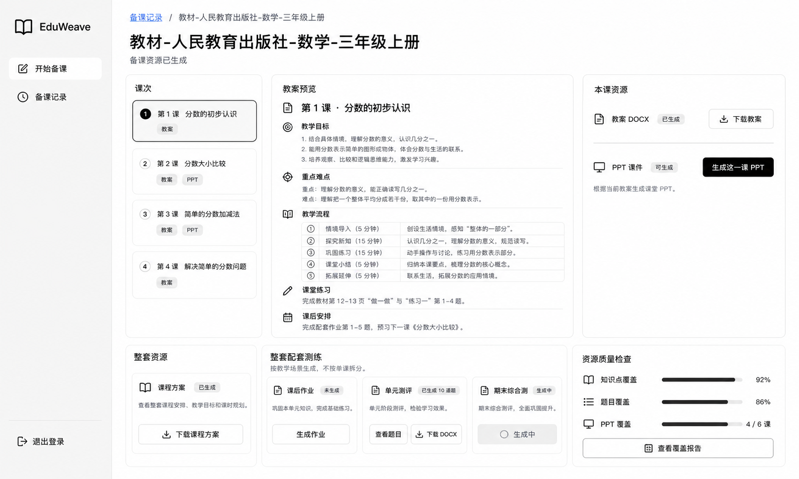
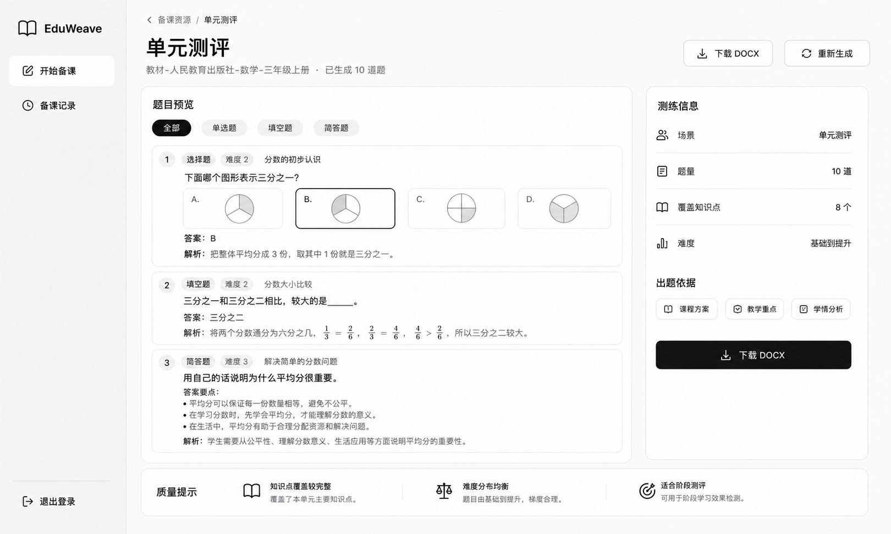
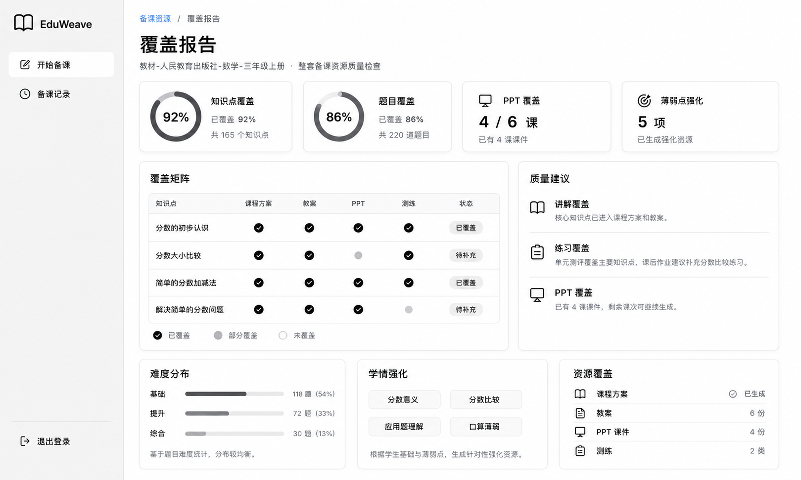

# EduWeave 前端产品化重构分阶段方案

更新时间：2026-05-24

## 原则

EduWeave 是交付给老师使用的完整产品。页面优先帮助老师完成备课，不解释内部概念，不暴露工程字段，不把调试信息放在主路径。

每次只实施一个 Phase。一个 Phase 完成后先构建、端测、验收，再进入下一阶段。

## Phase 1：首页与开始备课入口

目标：老师打开系统后，先上传教材 PDF，再补充学情分析 DOCX，最后开始备课。首页只保留必要操作和真实历史记录。

本阶段最终口径：

- 产品名称固定为 EduWeave。
- 视觉使用 Manus 风格的黑白灰体系：暖白背景、深灰文字、浅灰边框、黑色主按钮。
- 首页不展示绿色/墨绿色主视觉，不做多层白框嵌套。
- 初始只显示“上传教材 PDF”主入口。
- 选择教材后才显示“下一步：补充学情分析 DOCX”。
- 选择学情后才显示“开始备课”按钮。
- 开始备课复用现有创建、上传教材、上传学情接口。
- 系统直接使用教材 PDF 文件名作为名称。
- 学科和年级先基于教材文件名轻量推断，作为现有后端接口所需字段。
- 侧边栏只保留 EduWeave、开始备课、备课记录。
- 首页顶部不显示刷新、用户、退出等工具入口。
- 首页下方显示“最近备课”，最多展示 3 条真实记录；未完成优先，其次展示最近完成。
- 已完成备课进入成果页，未完成备课进入生成过程页。
- 首页不出现项目、批次、版本、任务、JSON、原始错误等工程信息。

验收标准：

- 打开首页只看到教材上传主入口。
- 选择教材后才出现学情上传。
- 选择学情后才出现开始备课。
- 最近备课卡片能按状态进入生成过程页或成果页。
- 首页视觉为黑白灰，主按钮为黑色。
- 首页不出现工程化概念和大段技术错误。

## Phase 2：生成流程页产品化

目标：把当前工作台改成老师可理解的生成中处理过程页。

本阶段最终口径：

- `/projects/:projectId` 只用于正在生成、待处理或失败待处理的备课。
- 页面按“上传材料、理解教材、分析学情、整理教学重点、生成备课资源”展示进度。
- 已完成备课默认进入成果页，不把 Phase 2 当成历史页。
- 只有最近批次状态为 `success` 时，首页和备课记录才显示“已完成”并跳转成果页。
- PPT 课件按课生成，测练按场景生成；Phase 2 不把它们包装成已全部自动生成。
- 删除更换材料、重新开始备课、技术细节等主路径干扰。
- 隐藏队列名、模块名、长错误文本、JSON 和后端字段。

本阶段不做：

- 不做班级管理。
- 不做学生档案 CRM。
- 不做多学生聚合。
- 不做演示快进回放。

## Phase 3：成果详情页产品化

目标：把 `/projects/:projectId/batches/:batchId` 从批次后台详情页改成老师可直接使用的“备课资源页”。Phase 3 不再以 Tab 展示内部成果，而是围绕老师真实使用路径组织：选一课、看教案、生成这一课 PPT；整套测练和覆盖报告作为整套资源能力展示。

参考图：

- 备课资源主页面：
- 查看题目页面：
- 查看覆盖报告页面：

本阶段最终口径：

- 成果页使用 Manus 风格黑白灰视觉，不使用绿色、琥珀、米色等主视觉。
- 顶部使用轻量面包屑：`备课记录 / 教材名称`，不在右上角放突兀的“返回备课记录”按钮。
- 主页面结构为：
  - 左侧：课次列表。
  - 中间：当前课教案预览。
  - 右侧：当前课资源操作。
  - 下方：整套资源，包括课程方案、配套测练和覆盖报告。
- 教案预览必须是老师可读的文档式预览，不展示 `content_json` 或字段列表。
- PPT 课件按当前选中的某一课教案生成，不做“一键生成全部 PPT”。
- PPT 课件和课后作业都按当前选中的某一课教案生成，不做“一键生成全部”。
- 单元测评和期末综合测按整套课程生成。
- 覆盖报告是整套资源质量检查，只支持页面查看；当前后端没有覆盖报告导出接口，所以不展示“导出报告”或“下载报告”。
- 课程方案下载不放在顶部孤立按钮里，放入下方“整套资源”的课程方案卡片。
- 主 UI 不出现项目、批次、版本、任务、JSON、ID、后端字段、原始异常堆栈。

### Phase 3.1：备课资源主页面

重构 `/projects/:projectId/batches/:batchId`。

页面内容：

- 顶部：
  - 面包屑：`备课记录 / 教材名称`
  - 标题：教材文件名去掉 `.pdf` 后缀。
  - 副标题：`备课资源已生成`。
- 课次列表：
  - 展示每一课标题、课时信息和资源状态。
  - 默认选中第一课。
  - 只有已生成 PPT 的课才显示 `PPT` 状态，不给未生成课伪造 PPT 标识。
- 教案预览：
  - 展示当前课标题。
  - 展示教学目标、重点难点、教学流程、课堂练习、课后安排。
  - 如果某些字段后端没有稳定结构，优先展示可读摘要，不强行展示原始 JSON。
- 本课资源：
  - `教案 DOCX`：已生成则下载；未导出则触发导出后下载。
  - `PPT 课件`：
    - 未生成：显示 `生成这一课 PPT`。
    - 生成中：显示 `生成中`，不可重复点击。
    - 已生成：显示 `下载 PPT`。
    - 失败：显示 `重新生成`。
  - `课后作业`：
    - 未生成：显示 `生成这一课作业`。
    - 生成中：显示 `生成中`，不可重复点击。
    - 已生成：显示 `查看题目` 和 `下载 DOCX`。
    - 失败：显示 `重新生成`。
- 整套资源：
  - 课程方案卡片：展示已生成状态和 `下载课程方案`。
  - 整套配套测练卡片：展示单元测评和期末综合测；课后作业只显示 `已生成 N / 总课次` 总览。
  - 资源质量检查卡片：展示覆盖率摘要和 `查看覆盖报告`。

复用现有后端能力：

- 课程方案：`listCurriculumPlans`、`getCurriculumPlan`、`exportCurriculumPlanDocx`。
- 教案：`listLessonPlans`、`getLessonPlan`、`exportLessonPlanDocx`。
- PPT：`createCoursewareTask`、`listCoursewareResults`、`getCoursewareResult`、`refreshCoursewareResult`、`getFileDownloadUrl`。
- 课后作业：`createHomeworkTask`、`listHomeworkResults`、`getHomeworkResult`、`exportHomeworkResultDocx`。
- 测评：`createAssessmentTask`、`listPaperResults`、`exportPaperResultDocx`；仅用于单元测评和期末综合测。
- 覆盖报告：`listCoverageReports`、`getCoverageReport`。

### Phase 3.2：查看题目独立页面

新增题目查看详情页，不做 Modal。

建议路由：

- `/projects/:projectId/batches/:batchId/assessments/:paperResultId`
- `/projects/:projectId/batches/:batchId/homework/:homeworkResultId`

页面内容：

- 面包屑：`备课资源 / 单元测评` 或 `备课资源 / 课后作业`，点击 `备课资源` 返回 `/projects/:projectId/batches/:batchId`。
- 标题展示当前资源类型，如 `课后作业`、`单元测评`、`期末综合测`。
- 展示题量、题型、难度、覆盖知识点等摘要。
- 题目预览以卡片展示：
  - 题干
  - 题型
  - 难度
  - 知识点
  - 选项
  - 答案
  - 解析
- 支持题型筛选：全部、单选题、填空题、简答题。
- 已生成试卷提供 `下载 DOCX`。
- `重新生成` 仍按测练场景重新触发，不暗示按单课生成。

交互状态：

- 未生成：主资源页只显示 `生成这一课作业 / 生成测评 / 生成试卷`，不显示 `查看题目`。
- 生成中：显示 `生成中`，不可重复点击。
- 已生成：显示 `查看题目` 和 `下载 DOCX`。
- 失败：显示 `重新生成`。

### Phase 3.3：查看覆盖报告独立页面

新增覆盖报告详情页，不做 Modal。

建议路由：

- `/projects/:projectId/batches/:batchId/coverage/:coverageReportId`

页面内容：

- 面包屑：`备课资源 / 覆盖报告`，点击 `备课资源` 返回 `/projects/:projectId/batches/:batchId`。
- 标题：`覆盖报告`。
- 副标题：`整套备课资源质量检查`。
- 顶部指标：
  - 知识点覆盖
  - 题目覆盖
  - PPT 覆盖
  - 薄弱点强化
- 覆盖矩阵：
  - 知识点
  - 课程方案
  - 教案
  - PPT
  - 测练
  - 作业题目
  - 状态
- 质量建议：
  - 讲解覆盖
  - 练习覆盖
  - PPT 覆盖
- 下方补充：
  - 难度分布
  - 学情强化
  - 资源覆盖

边界：

- 当前不展示 `导出报告` 或 `下载报告`，因为后端没有覆盖报告导出接口。
- 不展示 `report_json`、`coverage_summary_json` 等原始 JSON。
- 如果某项统计缺失，显示产品化空态，例如 `等待资源同步`，不显示请求失败或后端字段名。

### Phase 3.4：旧成果页清理

- 移除成果页顶部 Tab 主结构。
- 移除主路径里的 `关联任务`、`TaskSummaryCard`、`JsonViewer`。
- 任务详情仍可保留在开发调试路由中，但不作为老师主路径入口。
- 统一按钮文案：
  - `下载课程方案`
  - `下载教案`
  - `生成这一课 PPT`
  - `下载 PPT`
  - `生成这一课作业`
  - `生成测评`
  - `生成试卷`
  - `查看题目`
  - `下载 DOCX`
  - `查看覆盖报告`

验收标准：

- 已完成备课从首页或备课记录进入 Phase 3 备课资源页。
- Phase 3 主页面可以完成：切换课次、预览教案、下载教案、生成/下载当前课 PPT、生成/查看/下载当前课作业。
- 课程方案下载入口只出现在“整套资源”的课程方案卡片里。
- 作业、单元测评、期末综合测未生成时不显示 `查看题目`；已生成后才显示 `查看题目` 和 `下载 DOCX`。
- 查看题目页能从面包屑返回备课资源页。
- 查看覆盖报告页能从面包屑返回备课资源页。
- 覆盖报告页不出现导出或下载报告按钮。
- 主 UI 不出现项目、批次、版本、任务、JSON、ID、后端字段、原始异常堆栈。
- 不新增假数据，不修改后端接口。

## Phase 4：示例过程回放

目标：解决长流程等待问题，同时保持产品视角。

设计方向：

- 入口命名为“查看示例备课”或“播放生成过程”。
- 回放基于真实已完成数据，不造假。
- 回放服务于老师理解“系统会如何生成”。

## Phase 5：最终验收

验收方式：

- 使用 `pnpm run build` 做构建检查。
- 使用 `git diff --check` 做差异检查。
- 使用 Chrome 或 Computer Use 做真实端测。

端测路径：

- 首页初始教材上传。
- 教材选择后的学情上传。
- 学情选择后的开始备课。
- 最近备课卡片进入生成过程或成果页。
- 后续每个 Phase 完成后再增加对应路径。

## 当前边界

- 当前已完成 Phase 1 首页入口和 Phase 2 生成中处理过程页。
- 不修改后端。
- 不引入假数据。
- 不做完整学生档案管理、班级聚合、标签、收藏、智能组卷。
