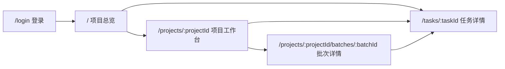
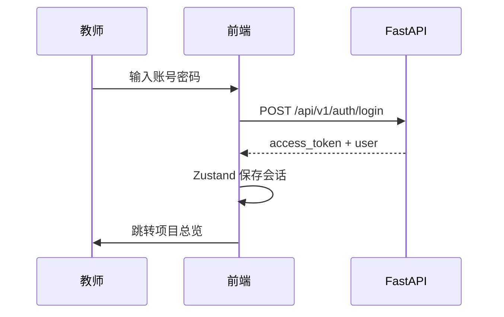

<!--
@Date: 2026-05-16
@Author: xisy / Codex
@Discription: EduWeave 前端详细设计说明书，覆盖信息架构、页面设计、数据流、接口类型、任务轮询与两周实施计划
-->

# EduWeave 前端详细设计说明书

- 文档版本：v0.1
- 编写日期：2026-05-16
- 作者：xisy / Codex
- 文档状态：初稿
- 项目名称：EduWeave 基于 MinerU 的“教材到课堂”全链路 AI 教学资源重构系统

## 1. 文档说明

本文档用于承接 EduWeave 需求规格、后端接口能力、当前前端 MVP 骨架和两周完整前端开发计划，明确前端后续实现的页面边界、数据流、接口依赖、交互状态和验收标准。

本文档定位于“前端详细设计”层，重点解决以下问题：

- 前端应如何组织项目总览、项目工作台、批次成果页和任务诊断页。
- 当前 MVP 已经完成哪些能力，下一阶段需要补齐哪些真实接口和展示页面。
- 如何只依赖真实后端接口完成比赛演示闭环，不引入 mock 数据兜底。
- 如何展示长任务状态、失败原因、成果结构化内容和导出文件。
- 如何安排两周开发节奏，让实现顺序服务真实联调和比赛展示。

本文档直接承接以下现有文档：

- `docs/教育赛题需求规格说明书.md`
- `docs/技术栈选型说明书.md`
- `docs/后端概要设计说明书.md`
- `docs/后端模块详细设计说明书.md`
- `docs/api文档.md`
- `docs/前端接入指南.md`

## 2. 当前前端状态

### 2.1 技术栈

当前前端位于 `frontend/`，采用以下技术栈：

| 类别 | 技术 | 说明 |
| --- | --- | --- |
| 构建工具 | Vite | 本地开发端口固定为 `127.0.0.1:7777` |
| UI 框架 | React 18 | 使用函数组件和 Hooks |
| 语言 | TypeScript | 接口响应和页面数据使用类型声明 |
| 样式 | Tailwind CSS | 使用项目自定义色板和少量组件类 |
| 路由 | React Router | 当前包含登录、项目总览、项目工作台 |
| 数据请求 | TanStack Query | 用于列表、详情、轮询和缓存失效 |
| 状态管理 | Zustand | 当前用于认证会话状态 |
| 图标 | lucide-react | 用于按钮、导航和模块标识 |

### 2.2 已完成页面

| 页面 | 路由 | 当前能力 |
| --- | --- | --- |
| 登录页 | `/login` | 支持教师账号登录，默认填充 `teacher_demo / Teacher@123` |
| 项目总览 | `/` | 支持项目列表、搜索、新建项目、最近任务轮询 |
| 项目工作台 | `/projects/:projectId` | 支持上传教材、发起解析、确认解析、上传学情、抽取知识、创建生成批次、查看任务列表 |

### 2.3 已接入接口

当前 `frontend/src/lib/api.ts` 已封装以下接口：

- `POST /api/v1/auth/login`
- `GET /api/v1/auth/me`
- `GET /api/v1/projects`
- `POST /api/v1/projects`
- `GET /api/v1/projects/{project_id}`
- `GET /api/v1/projects/{project_id}/dashboard`
- `GET /api/v1/tasks`
- `GET /api/v1/tasks/{task_id}`
- `POST /api/v1/projects/{project_id}/textbooks`
- `GET /api/v1/projects/{project_id}/textbooks`
- `POST /api/v1/textbook-versions/{textbook_version_id}/parse-tasks`
- `GET /api/v1/textbook-versions/{textbook_version_id}/parse-versions`
- `POST /api/v1/parse-versions/{parse_version_id}/confirm`
- `POST /api/v1/projects/{project_id}/learner-profiles`
- `GET /api/v1/projects/{project_id}/learner-profiles`
- `GET /api/v1/projects/{project_id}/learner-profiles/{profile_file_id}/versions`
- `POST /api/v1/parse-versions/{parse_version_id}/knowledge-tasks`
- `GET /api/v1/parse-versions/{parse_version_id}/knowledge-versions`
- `POST /api/v1/generation-batches`
- `GET /api/v1/generation-batches`
- `GET /api/v1/generation-batches/{generation_batch_id}`

### 2.4 已验证状态

- 本地前端端口：`http://127.0.0.1:7777`
- 本地后端端口：`http://127.0.0.1:8010`
- API client 默认兜底：`http://127.0.0.1:8010`
- `npm run build` 已通过。
- 后端 `/health` 与 `/ready` 已通过本地验证，MySQL、Redis、Milvus 均正常。

### 2.5 未完成能力

当前前端仍缺少以下关键能力：

- 生成批次详情页尚未落地。
- 课程大纲、教案、测评、课件、覆盖率结果尚未展示。
- 任务详情页和任务步骤诊断尚未落地。
- 导出 DOCX/PPTX 的下载入口尚未统一封装。
- 外部服务失败时的错误解释和恢复指引仍较基础。
- 项目工作台的业务流程还需要重构成更清晰的“准备 -> 生成 -> 监控”结构。
- 全局空状态、加载态、失败态和比赛展示级视觉精修尚未完成。

## 3. 设计目标

### 3.1 核心目标

前端下一阶段的核心目标是形成“只接真实接口”的完整教师工作台，使教师能够完成以下闭环：

```text
登录
  -> 创建项目
  -> 上传教材与学情
  -> 发起教材解析
  -> 确认解析版本
  -> 抽取知识结构
  -> 创建生成批次
  -> 查看课程大纲、教案、测评、课件、覆盖率
  -> 导出成果文件
  -> 查看任务状态与失败原因
```

### 3.2 设计原则

- 真实接口优先：所有业务内容来自后端真实响应，不内置 mock 成果。
- 主链路优先：优先保证比赛演示所需闭环，再补充高级筛选和边缘操作。
- 任务可诊断：长耗时任务必须显示状态、进度、阶段、失败原因和详情入口。
- 成果可阅读：课程大纲、教案、试卷、课件和覆盖率报告需要结构化展示，而不是只显示 JSON。
- 导出可交付：有导出能力的成果必须提供明确下载入口。
- 只读为主：当前后端未提供成果编辑保存接口，前端不设计伪编辑能力。
- 桌面优先：比赛演示以桌面宽屏为主，同时保证移动端基础可用。

### 3.3 明确不做

- 不新增 mock 数据。
- 不新增静态演示兜底。
- 不改后端接口。
- 不引入大型 UI 框架重写现有前端。
- 不做多人协作、实时编辑、学生端答题等 P1 能力。
- 不把 `frontend/node_modules/`、`frontend/dist/`、本地 `.env` 纳入版本管理。

## 4. 信息架构

### 4.1 路由设计

| 路由 | 页面 | 说明 |
| --- | --- | --- |
| `/login` | 登录页 | 教师账号登录，登录成功后进入项目总览 |
| `/` | 项目总览页 | 项目列表、新建项目、最近任务 |
| `/projects/:projectId` | 项目工作台 | 项目准备、基线选择、任务发起、批次入口 |
| `/projects/:projectId/batches/:batchId` | 生成批次详情页 | 展示课程大纲、教案、测评、课件、覆盖率和批次任务 |
| `/tasks/:taskId` | 任务详情页 | 展示任务基础信息、步骤、错误和结果摘要 |

### 4.2 页面关系



### 4.3 侧边导航

当前左侧导航保留轻量结构：

- 项目总览
- 当前项目入口仅在项目相关页面上下文内展示，不新增复杂全局菜单。
- 任务详情通过任务列表或失败提示进入，不作为一级全局导航。

## 5. 页面详细设计

### 5.1 登录页

#### 页面目标

完成教师账号登录，并建立前端认证会话。

#### 布局设计

- 桌面端采用左侧品牌视觉区 + 右侧登录表单。
- 移动端仅保留品牌头部和登录表单。
- 保留默认演示账号填充值，方便本地开发和比赛演示。

#### 用户动作

| 动作 | 接口 | 成功行为 | 失败行为 |
| --- | --- | --- | --- |
| 登录 | `POST /api/v1/auth/login` | 保存 token 和用户信息，跳转 `/` | 显示后端错误信息 |

#### 状态处理

- 已登录访问 `/login` 时跳转 `/`。
- 登录中按钮显示 loading 并禁用重复提交。
- 401 或 `INVALID_CREDENTIALS` 显示明确错误。

### 5.2 项目总览页

#### 页面目标

让教师快速创建项目、进入项目、查看最近任务状态。

#### 布局设计

- 顶部：页面标题、项目搜索框。
- 左侧或上方：新建项目表单。
- 主区域：项目卡片列表。
- 底部：最近任务表格。

#### 用户动作

| 动作 | 接口 | 成功行为 | 失败行为 |
| --- | --- | --- | --- |
| 获取项目列表 | `GET /api/v1/projects` | 展示项目卡片 | 显示空状态或错误 |
| 创建项目 | `POST /api/v1/projects` | 跳转项目工作台 | 显示后端错误信息 |
| 查看最近任务 | `GET /api/v1/tasks` | 展示任务表格 | 显示错误状态 |

#### 状态处理

- 项目列表首次加载显示 loading。
- 无项目时显示空状态和新建项目入口。
- 最近任务每 5 秒轮询。
- 项目卡片展示项目名、学科、年级、状态、最近更新时间。

### 5.3 项目工作台

#### 页面目标

项目工作台负责主链路输入和任务发起，不承载大量成果阅读。它需要让教师清楚知道当前项目是否已具备生成条件。

#### 布局设计

页面按三段组织：

1. 准备区
   - 教材上传与教材版本选择。
   - 解析任务发起与解析版本确认。
   - 学情上传与学情版本选择。
   - 知识抽取与知识版本选择。
2. 生成区
   - 生成批次名称。
   - 课次数量。
   - 单次课时分钟数。
   - 测评策略基础配置。
   - 创建生成批次按钮。
3. 监控区
   - 当前项目任务表。
   - 最近生成批次列表。
   - 批次详情入口。

#### 用户动作

| 动作 | 接口 | 成功行为 | 失败行为 |
| --- | --- | --- | --- |
| 获取项目详情 | `GET /api/v1/projects/{project_id}` | 展示项目基础信息 | 显示项目不存在 |
| 获取项目看板 | `GET /api/v1/projects/{project_id}/dashboard` | 展示统计和最近任务 | 显示降级空状态 |
| 上传教材 | `POST /api/v1/projects/{project_id}/textbooks` | 更新教材列表并选中新版本 | 显示上传错误 |
| 发起解析 | `POST /api/v1/textbook-versions/{id}/parse-tasks` | 刷新任务列表 | 显示任务创建错误 |
| 确认解析 | `POST /api/v1/parse-versions/{id}/confirm` | 刷新解析版本和项目状态 | 显示确认错误 |
| 上传学情 | `POST /api/v1/projects/{project_id}/learner-profiles` | 更新学情列表并选中新文件 | 显示上传错误 |
| 抽取知识 | `POST /api/v1/parse-versions/{id}/knowledge-tasks` | 刷新任务列表 | 显示任务创建错误 |
| 创建批次 | `POST /api/v1/generation-batches` | 跳转批次详情页 | 显示创建错误 |

#### 禁用规则

- 未选择教材文件时禁用“上传教材”。
- 未选中教材版本时禁用“发起解析”。
- 未选中解析版本时禁用“确认解析”和“抽取知识”。
- 未选择学情版本或知识版本时禁用“创建批次”。
- 任一 mutation 执行中禁用对应按钮，避免重复提交。

#### 状态处理

- 教材、学情、解析版本、知识版本列表分别显示 loading、empty、error。
- 任务轮询刷新后自动更新当前步骤和失败原因。
- 生成批次创建成功后进入 `/projects/:projectId/batches/:batchId`。

### 5.4 生成批次详情页

#### 页面目标

集中展示一个生成批次的所有成果和任务状态，是比赛演示的核心页面。

#### 布局设计

- 顶部：返回项目工作台、批次名称、批次状态、创建时间、刷新按钮。
- 概览区：知识版本、学情版本、课程数量、课时时长、任务完成情况。
- 标签页：
  - 课程大纲
  - 教案
  - 测评
  - 课件
  - 覆盖率
  - 任务

#### 批次基础数据

| 数据 | 接口 |
| --- | --- |
| 批次详情 | `GET /api/v1/generation-batches/{generation_batch_id}` |
| 批次任务 | 批次详情内 `tasks` 或 `GET /api/v1/tasks?project_id=&generation_batch_id=` 的可用组合 |

#### 课程大纲标签页

接口：

- `GET /api/v1/curriculum-plans?project_id={projectId}&knowledge_version_id={knowledgeVersionId}`
- `GET /api/v1/curriculum-plans/{curriculum_plan_id}`
- `POST /api/v1/curriculum-plans/{curriculum_plan_id}/export-docx`

展示内容：

- 课程标题、摘要、版本状态。
- 课程总览、阶段目标、课程重点、课程难点。
- 课次安排列表：课次号、标题、时长、目标、重点、活动、作业。
- 学情适配策略。
- 覆盖知识点引用。
- 导出 DOCX 按钮。

空状态：

- 批次尚未生成课程大纲时，显示“课程大纲生成中或尚未创建”。
- 任务失败时，关联展示失败任务和错误原因。

#### 教案标签页

接口：

- `GET /api/v1/lesson-plans?curriculum_plan_id={curriculumPlanId}`
- `GET /api/v1/lesson-plans/{lesson_plan_id}`
- `POST /api/v1/lesson-plans/{lesson_plan_id}/export-docx`

展示内容：

- 教案列表：课次、标题、状态、更新时间。
- 教案详情：摘要、课程概述、物料清单、核心知识、教学流程、课次讲解安排、课后安排、学情适配。
- 导出 DOCX 按钮。

交互：

- 默认选中第一条或最新教案。
- 点击列表项切换详情。

#### 测评标签页

接口：

- `POST /api/v1/curriculum-plans/{curriculum_plan_id}/assessment-tasks`
- `GET /api/v1/assessment-blueprints?curriculum_plan_id={curriculumPlanId}`
- `GET /api/v1/assessment-blueprints/{assessment_blueprint_id}`
- `GET /api/v1/paper-results?generation_batch_id={batchId}`
- `GET /api/v1/paper-results/{paper_result_id}`
- `POST /api/v1/paper-results/{paper_result_id}/export-docx`

展示内容：

- 测评任务创建按钮。
- 蓝图列表：名称、场景、状态、版本。
- 蓝图详情：策略摘要、知识点权重、题型分布、难度分布。
- 试卷列表：标题、题量、状态、更新时间。
- 题目详情：题号、题型、难度、分值、题干、选项、答案、解析、来源摘要。
- 导出 DOCX 按钮。

默认测评策略：

```json
{
  "scenario_type": "unit_test",
  "scene_type": "unit_test",
  "question_count": 10,
  "question_types": ["single_choice", "fill_blank", "short_answer"],
  "difficulty_range": [1, 5]
}
```

#### 课件标签页

接口：

- `POST /api/v1/lesson-plans/{lesson_plan_id}/courseware-tasks`
- `GET /api/v1/courseware-results?generation_batch_id={batchId}`
- `GET /api/v1/courseware-results/{courseware_result_id}`
- `POST /api/v1/courseware-results/{courseware_result_id}/refresh`
- `POST /api/v1/courseware-results/{courseware_result_id}/reply`
- `GET /api/v1/files/{file_object_id}/download-url`

展示内容：

- 基于选中教案创建课件任务。
- 课件结果列表：对应教案、状态、页数、更新时间。
- 结构摘要：模板、页面类型统计、生成摘要。
- 远程预览状态：展示 `preview_json` 的关键字段。
- 如果远程任务需要补充回答，展示回答输入框和提交按钮。
- 如果已有 `export_file_id`，展示 PPTX 下载按钮。

#### 覆盖率标签页

接口：

- `GET /api/v1/coverage-reports?generation_batch_id={batchId}`
- `GET /api/v1/coverage-reports/{coverage_report_id}`

展示内容：

- 覆盖率百分比。
- 告警数量。
- 覆盖摘要。
- 报告详情。
- 未知结构字段通过 JSON inspector 展示。

#### 任务标签页

展示内容：

- 批次内任务表。
- 模块、类型、状态、进度、阶段、更新时间、失败原因。
- 点击任务进入 `/tasks/:taskId`。

### 5.5 任务详情页

#### 页面目标

为长任务失败、卡住或外部服务缺配置提供可诊断视图。

#### 接口

- `GET /api/v1/tasks/{task_id}`

#### 展示内容

- 任务基础信息：模块、类型、状态、进度、队列、worker task id。
- 业务键：`biz_key`。
- 当前阶段：`current_stage`。
- 重试信息：`retry_count / max_retry_count`。
- 时间线：创建、开始、完成、更新时间。
- 错误信息：`last_error_code`、`last_error_message`。
- 步骤列表：步骤名、状态、进度、开始时间、结束时间、明细。
- 载荷与结果：`payload_json`、`result_json` 使用只读 JSON inspector 展示。

#### 状态处理

- 任务 running/pending 时每 5 秒轮询。
- 任务 success/failed 后停止自动轮询。
- 失败时保留真实后端错误，不替换为前端泛化文案。

## 6. 数据流设计

### 6.1 登录数据流



### 6.2 项目准备数据流

```text
GET project
GET textbooks
GET learner profiles
GET tasks
  -> 选择或上传教材
  -> 创建解析任务
  -> 轮询任务与解析版本
  -> 确认解析版本
  -> 上传学情
  -> 轮询学情版本
  -> 创建知识任务
  -> 轮询知识版本
```

### 6.3 生成批次数据流

```text
选中 knowledge_version_id
选中 learner_profile_version_id
填写 batch_name/course_count/session_duration_minutes
POST /api/v1/generation-batches
  -> 返回 generation_batch_id
  -> 跳转批次详情页
  -> 轮询 batch detail/tasks/result lists
```

### 6.4 成果查看数据流

```text
GET generation batch detail
  -> 读取 curriculum_plan_id / lesson_plan_ids / task list
  -> 查询课程大纲
  -> 查询教案
  -> 查询测评结果
  -> 查询课件结果
  -> 查询覆盖率报告
  -> 按标签页展示结构化结果
```

### 6.5 导出下载数据流

```text
点击导出
  -> POST 对应 export-docx 接口
  -> 返回 FileDownloadUrlResponse
  -> window.open(signed_url)
```

对于课件 PPTX，如果结果已有 `export_file_id`：

```text
点击下载
  -> GET /api/v1/files/{file_object_id}/download-url
  -> 返回 signed_url
  -> window.open(signed_url)
```

## 7. API 与类型设计

### 7.1 API client 需补齐方法

前端 `api` 对象需要新增以下方法：

| 方法 | 后端接口 |
| --- | --- |
| `listCurriculumPlans` | `GET /api/v1/curriculum-plans` |
| `getCurriculumPlan` | `GET /api/v1/curriculum-plans/{id}` |
| `exportCurriculumPlanDocx` | `POST /api/v1/curriculum-plans/{id}/export-docx` |
| `listLessonPlans` | `GET /api/v1/lesson-plans` |
| `getLessonPlan` | `GET /api/v1/lesson-plans/{id}` |
| `exportLessonPlanDocx` | `POST /api/v1/lesson-plans/{id}/export-docx` |
| `createAssessmentTask` | `POST /api/v1/curriculum-plans/{id}/assessment-tasks` |
| `listAssessmentBlueprints` | `GET /api/v1/assessment-blueprints` |
| `getAssessmentBlueprint` | `GET /api/v1/assessment-blueprints/{id}` |
| `listPaperResults` | `GET /api/v1/paper-results` |
| `getPaperResult` | `GET /api/v1/paper-results/{id}` |
| `exportPaperResultDocx` | `POST /api/v1/paper-results/{id}/export-docx` |
| `createCoursewareTask` | `POST /api/v1/lesson-plans/{id}/courseware-tasks` |
| `listCoursewareResults` | `GET /api/v1/courseware-results` |
| `getCoursewareResult` | `GET /api/v1/courseware-results/{id}` |
| `refreshCoursewareResult` | `POST /api/v1/courseware-results/{id}/refresh` |
| `replyCoursewareResult` | `POST /api/v1/courseware-results/{id}/reply` |
| `listCoverageReports` | `GET /api/v1/coverage-reports` |
| `getCoverageReport` | `GET /api/v1/coverage-reports/{id}` |
| `getFileDownloadUrl` | `GET /api/v1/files/{id}/download-url` |

### 7.2 TypeScript 类型需补齐

前端 `types.ts` 需要补齐以下类型：

- `FileDownloadUrl`
- `CurriculumPlan`
- `CurriculumLessonSession`
- `LessonPlan`
- `LessonTeachingStep`
- `LessonSessionPlan`
- `AssessmentBlueprint`
- `AssessmentTaskPayload`
- `PaperResult`
- `QuestionItem`
- `CoursewareResult`
- `CoursewareReplyPayload`
- `CoverageReport`
- `TaskDetail`
- `TaskStep`

### 7.3 JSON 字段处理

后端部分结构化字段为 `dict[str, Any]`，前端处理规则如下：

- 已知字段按业务结构展示。
- 未知字段用只读 JSON inspector 展示。
- JSON inspector 不提供编辑保存能力。
- 空对象或空数组显示为“暂无结构化内容”。

## 8. 任务轮询与失败处理

### 8.1 轮询规则

| 数据 | 轮询频率 | 停止条件 |
| --- | --- | --- |
| 项目最近任务 | 5 秒 | 页面卸载 |
| 项目工作台任务 | 5 秒 | 页面卸载 |
| 解析版本 | 8 秒 | 页面卸载 |
| 学情版本 | 8 秒 | 页面卸载 |
| 知识版本 | 8 秒 | 页面卸载 |
| 批次详情 | 8 秒 | 批次 success/failed 后可降频或停止 |
| 批次成果列表 | 8 秒 | 对应结果出现且状态稳定后可停止 |
| 任务详情 | 5 秒 | task_status 为 success/failed |

### 8.2 失败状态展示

失败状态必须展示以下信息：

- 状态：`task_status` 或结果状态字段。
- 阶段：`current_stage`。
- 错误码：`last_error_code`。
- 错误信息：`last_error_message`。
- 任务详情入口。

外部服务缺少 token、MinerU 调用失败、LLM 调用失败、Raccoon PPT 调用失败等情况，前端展示后端真实错误，不使用假成功或假结果替代。

### 8.3 认证失败处理

- 任意接口返回 401 或 `TOKEN_EXPIRED` 时，清理本地 session。
- 自动跳转 `/login`。
- 登录页保留原有演示账号填充值。

## 9. 视觉与交互规范

### 9.1 整体风格

前端采用面向教师的工作台风格：

- 信息密度适中，优先可读和可操作。
- 不做营销型首页。
- 不使用大面积装饰渐变和无意义视觉背景。
- 卡片用于具体资源、结果、任务，不嵌套卡片。
- 页面区块以清晰分隔和稳定布局为主。

### 9.2 成果详情布局

批次详情页采用“上方概要 + 下方标签页”的结构：

- 概要区展示状态、基线、时间、核心指标。
- 标签页切换不同成果类型。
- 成果正文优先使用文档式排版。
- 右侧或顶部提供导出、刷新、创建任务等操作。

### 9.3 按钮与控件

- 关键动作按钮使用图标 + 文本。
- 仅图标按钮必须提供 `title`。
- 上传、创建、导出、刷新、回复等异步操作需要 loading 状态。
- 缺少依赖数据时按钮禁用，并通过邻近说明或空状态解释原因。

### 9.4 空状态

空状态需要说明“为什么为空”和“下一步动作”：

- 未上传教材：提示上传 PDF 教材。
- 未产生解析版本：提示先发起解析并等待任务完成。
- 未确认解析：提示选择解析版本并确认。
- 未生成知识结构：提示抽取知识。
- 未创建批次：提示完成知识和学情基线后创建批次。
- 批次无成果：提示任务可能仍在运行，并提供任务标签页入口。

### 9.5 响应式底线

- 桌面端作为比赛演示主视图，需要优先保证 1440px 宽度体验。
- 平板和移动端必须能完成登录、进入项目、查看任务和成果。
- 宽表格需要横向滚动，不允许文字挤压重叠。
- 关键按钮和标题在 320px 宽度下不应溢出。

## 10. 两周实施排期

### 10.1 赛题材料导入策略

真实联调与比赛演示使用本机赛题材料目录：

```text
/Users/seven/Downloads/教育赛题
```

目录内容按当前检查结果分为三类：

| 子目录 | 内容 | 前端使用阶段 | 说明 |
| --- | --- | --- | --- |
| `教材文档/` | 29 份教材 PDF | 第 3-5 天开始使用 | 用于教材上传、教材解析、知识抽取和后续生成批次 |
| `学情分析/` | 20 份学生学情 `.docx` | 第 3-5 天开始使用 | 用于学情上传、学情版本抽取和个性化生成 |
| `示例文件/` | 教学大纲参考 `.doc`、教师讲义教案参考 `.docx` | 第 11-14 天参考 | 仅作为人工对照材料，不作为前端 mock 数据 |

赛题材料不在 Phase 1 导入。Phase 1 只补 API、类型、路由和任务状态能力。Phase 2 重构项目工作台时开始使用真实赛题材料走链路；Phase 4 和 Phase 5 复用这些真实数据展示成果与导出；Phase 6 固化一条稳定演示路径。

推荐首条联调链路：

| 类型 | 文件 | 选择原因 |
| --- | --- | --- |
| 学情 | `/Users/seven/Downloads/教育赛题/学情分析/学生1.docx` | 三年级，包含语文、数学两科，内容有成绩、问题描述和培训规划 |
| 教材 | `/Users/seven/Downloads/教育赛题/教材文档/教材-北京出版社-数学-三年级下册.pdf` | 与学生1数学教材匹配，文件约 10MB，页数约 102 页，适合首次联调 |

不建议首次联调直接导入全部教材。部分 PDF 文件较大，例如西南大学出版社二年级数学教材约 437MB，适合在主链路稳定后再做压力式验证。

赛题材料本身能够覆盖教材和学情输入，但完整后台链路仍依赖外部服务配置。若 `OBS`、`MINERU_API_TOKEN`、`LLM_API_KEY`、`LLM_MODEL`、`EMBEDDING_API_KEY`、`EMBEDDING_MODEL` 或课件相关 token 未配置，前端必须展示真实任务失败信息，不允许使用本地假结果兜底。

### 10.2 第 1-2 天：基础能力补齐

- 补齐 API client 方法。
- 补齐 TypeScript 类型。
- 新增下载工具函数。
- 新增 JSON inspector。
- 新增任务详情页。
- 补充 `.gitignore` 对 `frontend/node_modules/` 和 `frontend/dist/` 的忽略。

### 10.3 第 3-5 天：项目工作台重构

- 将项目工作台拆成准备区、生成区、监控区。
- 优化教材、解析、学情、知识版本选择体验。
- 使用 `/Users/seven/Downloads/教育赛题` 中的真实教材 PDF 和学情 DOCX 做上传联调。
- 创建批次成功后跳转批次详情页。
- 优化任务表，支持进入任务详情。

### 10.4 第 6-8 天：批次详情核心成果页

- 新增批次详情路由和页面。
- 接入课程大纲列表、详情和导出。
- 接入教案列表、详情和导出。
- 接入批次任务标签页。

### 10.5 第 9-10 天：测评、课件、覆盖率

- 接入测评任务创建、蓝图、试卷、题目详情和导出。
- 接入课件任务创建、结果列表、详情、刷新、回复和 PPTX 下载。
- 接入覆盖率报告列表和详情。

### 10.6 第 11-12 天：视觉与交互精修

- 统一加载态、空状态、失败态。
- 优化批次详情页文档式阅读体验。
- 优化按钮禁用、错误展示和任务诊断入口。
- 完成桌面宽屏和移动端基础适配。

### 10.7 第 13-14 天：真实联调与验收

- 使用 `/Users/seven/Downloads/教育赛题` 中选定的演示材料走完整链路。
- 验证外部服务失败时的真实错误展示。
- 验证导出下载入口。
- 修复构建、类型、路由、视觉和联调问题。
- 更新 README 或前端运行说明。

## 11. 验收清单

### 11.1 构建与环境

- `npm run build` 通过。
- 前端运行在 `http://127.0.0.1:7777`。
- 后端 API 使用 `http://127.0.0.1:8010`。
- 不提交 `node_modules`、`dist`、本地 `.env`。

### 11.2 主链路

- 能使用 `teacher_demo / Teacher@123` 登录。
- 能创建项目。
- 能从 `/Users/seven/Downloads/教育赛题` 选择真实教材和学情材料。
- 能上传教材 PDF。
- 能发起解析任务。
- 能查看并确认解析版本。
- 能上传学情文件。
- 能抽取知识结构。
- 能创建生成批次。
- 能进入批次详情页。

### 11.3 成果页

- 能查看课程大纲详情。
- 能查看教案列表和详情。
- 能创建并查看测评结果。
- 能创建并查看课件结果。
- 能查看覆盖率报告。
- 能从成果页进入关联任务详情。

### 11.4 导出下载

- 课程大纲 DOCX 导出可触发。
- 教案 DOCX 导出可触发。
- 试卷 DOCX 导出可触发。
- 课件 PPTX 下载可触发。
- 文件下载地址通过真实 `signed_url` 打开。

### 11.5 失败场景

- Token 过期后回到登录页。
- 任务失败时展示真实错误码和错误信息。
- 外部服务配置缺失时不展示假结果。
- 空结果页显示明确下一步动作。

### 11.6 UI 检查

- 桌面宽屏无明显重叠、错位、溢出。
- 移动端能完成核心浏览。
- 表格横向滚动可用。
- 按钮 loading 和 disabled 状态正确。
- 成果详情内容可读，不只展示大段原始 JSON。

## 12. 实现约束

- 前端只消费后端现有接口，不主动改变后端契约。
- 当前成果内容只读，不设计编辑保存入口。
- 所有业务失败以真实后端响应为准。
- 批次详情页是比赛演示核心页面，开发优先级高于全局装饰性优化。
- 任务详情页是故障诊断核心页面，必须在真实联调前完成。
- 文档作为后续实现 checklist，功能完成时应逐项对照验收。
