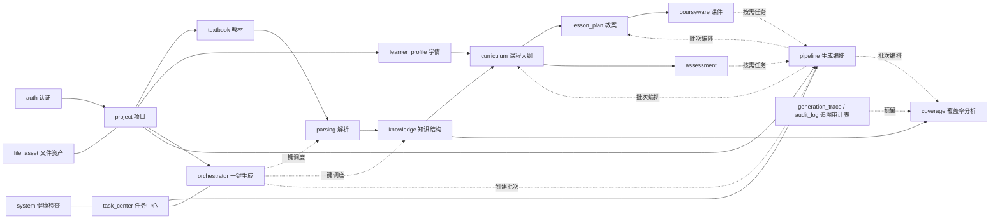

# EduWeave 后端模块详细设计说明书

- 文档版本：v0.4
- 编写日期：2026-05-26
- 作者：xisy / Codex
- 文档状态：初稿
- 项目名称：EduWeave 基于 MinerU 的“教材到课堂”全链路 AI 教学资源重构系统

## 1. 文档说明

本文档在 [docs/后端概要设计说明书](/Users/xisy/Personal/Projects/EduWeave/docs/后端概要设计说明书.md) 的基础上，进一步细化后端模块边界、模块内部分层、关键职责、模块协作方式与实现约束，为后续后端脚手架初始化、模块编码、接口详细设计和联调排期提供直接依据。

本文档聚焦“模块详细设计”层，主要解决以下问题：

- 后端应该拆成哪些模块。
- 每个模块内部应该包含哪些文件和职责。
- 模块之间的依赖方向如何控制。
- 哪些能力走同步请求，哪些能力必须走异步任务。
- 哪些共性能力应下沉到 `core` 或 `shared`，避免业务模块重复造轮子。

## 2. 设计依据与范围

本设计直接承接以下文档，不另行引入脱离现有需求的新业务模块：

- [docs/教育赛题要求.md](/Users/xisy/Personal/Projects/EduWeave/docs/教育赛题要求.md)
- [docs/教育赛题需求规格说明书.md](/Users/xisy/Personal/Projects/EduWeave/docs/教育赛题需求规格说明书.md)
- [docs/技术栈选型说明书.md](/Users/xisy/Personal/Projects/EduWeave/docs/技术栈选型说明书.md)
- [docs/后端概要设计说明书.md](/Users/xisy/Personal/Projects/EduWeave/docs/后端概要设计说明书.md)

本期详细设计覆盖后端 P0 主链路模块：

- 认证与安全支撑
- 项目管理
- 教材管理
- 学情管理
- 教材解析
- 知识结构化
- 课程大纲
- 教案
- 测评蓝图与试卷
- 课件
- 覆盖率分析
- 一键生成编排
- 任务中心
- 文件资产与系统健康检查
- 轻量生成追溯与审计表预留
- 共享基础设施

## 3. 模块设计总览

### 3.1 模块依赖链

后端业务模块需要严格沿着“输入资产 -> 中间结构 -> 规划结果 -> 最终产物 -> 校验追溯”的方向依赖，避免出现下游模块反向依赖上游实现细节的情况。

### 3.2 模块分层约定

每个业务模块内部统一采用“小模块内局部分层”结构，默认包含以下文件：

| 文件 | 职责 |
| --- | --- |
| `router.py` | 暴露 REST 接口，完成参数绑定、依赖注入、响应封装 |
| `service.py` | 编排业务流程、控制事务边界、触发任务、处理版本生效 |
| `repository.py` | 封装数据库查询、聚合查询、分页和基础持久化 |
| `schemas.py` | Pydantic 请求响应模型和结构化对象约束 |
| `models.py` | SQLAlchemy ORM 模型定义 |
| `tasks.py` | 模块专属异步任务入口，供 Celery Worker 调度 |
| `tests/` | 模块内单测和集成测试 |

若模块当前不需要异步任务，则可以暂不创建 `tasks.py`，但文件命名规则保持预留。

### 3.3 模块协作规则

- `router` 不直接访问数据库，只调用 `service`。
- `service` 不直接拼接复杂 SQL，只通过 `repository` 访问持久层。
- `repository` 只处理数据读写，不承担业务编排。
- 模块间调用优先通过对方 `service` 暴露的应用级能力，而不是跨模块直接操作对方表模型。
- 所有外部基础设施能力统一走 `shared`，业务模块不得直接散落第三方 SDK 调用。
- 所有配置、异常、日志、认证、中间件统一下沉到 `core`。
- 任务创建、步骤记录和状态查询由 `task_center` 仓储与服务维护；`shared.queue` 负责 Celery 应用、统一派发、测试内联执行和队列路由。

### 3.4 同步与异步边界

为避免接口阻塞，模块能力按以下原则划分：

- 同步请求：项目创建、文件元数据查询、版本列表、详情查看、工作台聚合、任务轮询、下载地址获取、基础人工编辑保存、DOCX 导出归档。
- 异步任务：教材解析、学情抽取、知识抽取、课程大纲生成、教案生成、测评蓝图与题目生成、课件生成、初始覆盖率分析、局部重解析、增量重算。

## 4. 公共支撑模块详细设计

### 4.1 `core` 模块

`core` 不是业务域模块，但它决定了整个后端的工程边界，应在项目初始化阶段优先落地。

| 子模块 | 设计职责 |
| --- | --- |
| `core.config` | 管理应用配置、OBS 配置、MySQL 配置、Redis 配置、Milvus 配置、模型配置与功能开关 |
| `core.database` | 提供 SQLAlchemy Engine、Session、事务依赖与数据库初始化入口 |
| `core.exceptions` | 统一业务异常类型、错误码、全局异常处理与错误响应转换 |
| `core.logging` | 结构化日志、`request_id` 透传、任务日志上下文、日志格式配置 |
| `core.security` | JWT 鉴权、当前用户依赖、密码与令牌工具 |
| `core.middleware` | `request_id` 中间件、异常中间件、CORS、访问日志中间件 |

`core` 的关键规则如下：

- 配置读取统一通过 `pydantic-settings` 实现，不允许业务模块直接读环境变量。
- 时间字段统一由公共时间工具生成，数据库内以 UTC 存储。
- 统一响应壳与统一异常处理必须在应用启动时注册完成。
- JWT 鉴权、当前用户依赖和访问控制只在 `core.security` 实现一次。

### 4.2 `shared` 模块

`shared` 用于承载跨模块复用的基础设施适配层和通用工具，避免第三方依赖散落在多个业务模块中。

| 子模块 | 设计职责 |
| --- | --- |
| `shared.storage` | 华为云 OBS 上传、下载、对象路径生成、签名地址、对象删除与存在性检查 |
| `shared.mineru` | 教材解析调用、解析参数封装、解析结果标准化、错误归一 |
| `shared.llm` | 任务内 Prompt 组装、模型调用、结构化输出校验、JSON 修复、失败重试 |
| `shared.document` | 课程大纲、教案、试卷等 DOCX 渲染、OBS 归档与下载地址生成 |
| `shared.ppt` | Raccoon PPT OpenAPI 任务创建、轮询、补充回复与 PPTX 下载 |
| `shared.queue` | Celery 实例、统一派发、测试内联执行、队列路由 |
| `shared.vector` | Milvus 接入适配、集合管理、语义块与知识点向量写入、删除、检索、健康检查 |
| `shared.utils` | 哈希计算、分页工具、时间工具、文本清洗、枚举与常量工具 |

`shared` 的关键规则如下：

- `shared.vector` 对接的是 Milvus 向量数据库组件，而不是自建向量引擎。
- `shared.vector` 在 P0 阶段即需提供可用实现，用于教材语义块、知识点与证据召回。
- `shared.llm` 返回结果必须先通过 Schema 校验，再进入业务层入库。
- `shared.storage` 不负责业务归属关系，只负责文件对象能力本身。
- `shared.queue` 统一封装任务投递与内联执行，避免业务模块各自直接操作 Celery。
- `task_center` 负责统一任务记录、步骤记录、查询视图和自动恢复辅助，不反向依赖具体业务模块的领域逻辑。

### 4.3 `system` 与 `file_asset` 公共能力

`system` 和 `file_asset` 不承担复杂领域流程，但它们是前后端联调和文件交付的公共入口。

| 模块 | 当前职责 |
| --- | --- |
| `system` | 提供健康检查与依赖就绪检查，用于本地启动、部署探活和联调排障 |
| `file_asset` | 基于统一文件对象生成 OBS 临时签名下载地址，供教材源文件、解析产物、DOCX 与 PPTX 成果物复用 |

当前实现中，`file_object` 元数据仍由具体业务模块或 `shared.document`、`courseware` 等归档流程写入；`file_asset` 只负责下载访问，不负责业务归属判断和文件上传编排。

### 4.4 认证与用户支撑子域

本期角色较少，不单独拆成复杂用户中心模块，但需要明确提供 `modules/auth` 认证模块，和 `core.security` 共同构成认证支撑子域。

| 设计项 | 说明 |
| --- | --- |
| 角色范围 | 教师 |
| 主要接口 | 登录、获取当前用户信息 |
| 账户来源 | P0 采用初始化种子账户，不开放公开注册 |
| 会话策略 | 基于短时 JWT Access Token |
| 会话持久化 | P0 不单独设计服务端登录会话表，令牌失效后通过重新登录获取新令牌 |
| 权限控制 | 基于 JWT Bearer + 当前用户依赖注入 |
| 扩展方向 | P1 再扩展组织、租户、细粒度资源权限 |

`auth` 模块的实现职责如下：

- 校验用户名和密码，签发访问令牌。
- 提供当前用户信息查询接口，供前端工作台初始化使用。
- 向其他业务模块统一输出 `get_current_user` 等认证依赖。

## 5. 业务模块详细设计

### 5.1 `project` 模块

`project` 是轻量业务上下文容器和项目工作台入口，负责把教材、学情、任务和成果物组织到统一项目空间中，并提供默认版本引用与聚合查询能力；它不承担解析、抽取和生成的领域逻辑。

| 设计项 | 说明 |
| --- | --- |
| 模块定位 | 统一承载项目基础信息、默认版本引用和项目工作台聚合查询 |
| 核心输入 | 项目名称、学科、年级、适用对象、备注、项目状态、默认版本切换指令 |
| 核心输出 | 项目详情、工作台数据、默认教材/学情引用、最近生成批次摘要 |
| 主要子组件 | `project.router`、`project.service`、`project.repository`、`project.schemas`、`project.models` |
| 依赖模块 | `textbook`、`learner_profile`、`task_center` |

关键业务规则如下：

- 项目创建后才允许关联教材和学情文件。
- `project` 只负责项目归属关系、默认版本引用和工作台聚合，不直接承担教材解析、学情抽取、知识结构化、课程大纲生成、教案生成、课件生成、试卷生成与覆盖率分析。
- 项目工作台不重复保存冗余统计表，优先通过聚合查询生成。
- 项目模型预留 `active`、`archived`、`disabled` 状态，当前实现尚未开放删除、归档或停用入口。
- 项目需要记录 `current_textbook_version_id`、`current_learner_profile_version_id`、`latest_generation_batch_id` 和 `active_generation_run_id`，便于工作台默认回显、生成入口预填和单项目活跃 run 幂等控制。
- “一键生成”跨阶段串联流程统一由 `orchestrator` 模块承接；批次创建后的课程大纲、教案与覆盖率自动链继续由 `pipeline` 模块承接。

### 5.2 `textbook` 模块

`textbook` 模块负责项目内教材版本和教材文件元数据管理，是解析流程的直接上游。P0 阶段不额外拆分教材逻辑档案，后续若出现跨项目复用诉求，再抽象独立教材主档。

| 设计项 | 说明 |
| --- | --- |
| 模块定位 | 管理项目内教材版本、教材文件元数据与默认版本切换 |
| 核心输入 | PDF 文件、教材名称、出版社、学科、年级、册别、版本号 |
| 核心输出 | 教材详情、教材版本列表、当前默认版本、下载信息 |
| 主要子组件 | `textbook.router`、`textbook.service`、`textbook.repository`、`textbook.schemas`、`textbook.models` |
| 依赖模块 | `project`、`shared.storage` |

关键业务规则如下：

- 同一项目下允许同一教材存在多个上传版本。
- 教材文件上传后先登记为版本，再决定是否发起解析。
- 教材识别信息当前以人工补录和文件名兜底为主，`auto_identify_json` 仅记录来源；自动识别能力尚未接入。
- P0 阶段以 `project + textbook_version + file_object` 为主建模，不额外拆出 `textbook_document`。

### 5.3 `learner_profile` 模块

`learner_profile` 模块负责学情文档管理、学情抽取和“学生-学科”画像记录维护。

| 设计项 | 说明 |
| --- | --- |
| 模块定位 | 管理学情文件版本、学情结构化结果和学情画像记录 |
| 核心输入 | doc/docx 学情文件、人工修正字段 |
| 核心输出 | 学情文件详情、学情版本列表、画像记录列表、画像摘要 |
| 主要子组件 | `learner_profile.router`、`learner_profile.service`、`learner_profile.repository`、`learner_profile.schemas`、`learner_profile.models`、`learner_profile.tasks` |
| 依赖模块 | `project`、`shared.storage`、`shared.mineru`、`learner_profile.rules`、`shared.queue` |

关键业务规则如下：

- 学情文档是文件对象，画像记录是结构化结果，两者分层保存。
- 一份学情文档可以拆出多条“学生标识 + 学科”记录。
- 学情人工修正后生成新的学情版本，旧版本仍保留。
- 课程规划、教案和测评蓝图默认使用项目当前生效的学情版本。

### 5.4 `parsing` 模块

`parsing` 模块是教材到结构化内容的关键入口，负责解析任务、解析版本、页块结构、异常检测、页级重解析和人工修正生效。

| 设计项 | 说明 |
| --- | --- |
| 模块定位 | 管理教材解析全流程和解析结果版本链 |
| 核心输入 | 教材版本、解析策略、页范围、人工修正内容 |
| 核心输出 | 解析版本详情、页级结构、块级结构、异常记录、对照预览数据 |
| 主要子组件 | `parsing.router`、`parsing.service`、`parsing.repository`、`parsing.schemas`、`parsing.models`、`parsing.tasks` |
| 依赖模块 | `textbook`、`shared.mineru`、`shared.storage`、`shared.queue` |

关键业务规则如下：

- 每次全量解析和页级重解析都必须产生新的解析版本。
- 人工修正结果通过新解析版本与差异摘要生效，不覆盖历史记录。
- 解析模块负责判断当前有效解析版本，但不直接执行知识抽取。
- 异常记录至少覆盖缺页、乱码、标题错位、公式截断、表格断裂和图表说明缺失。

### 5.5 `knowledge` 模块

`knowledge` 模块负责把已确认解析版本转换成教材语义块、章节树、知识点矩阵、教学目标摘要与来源证据，是生成链路的基础数据源。

| 设计项 | 说明 |
| --- | --- |
| 模块定位 | 从已确认可用的解析版本抽取知识结构，并维护知识版本 |
| 核心输入 | 解析版本、知识点人工修正内容 |
| 核心输出 | 教材语义块、章节树、知识点矩阵、教学目标摘要、知识版本详情 |
| 主要子组件 | `knowledge.router`、`knowledge.service`、`knowledge.repository`、`knowledge.schemas`、`knowledge.models`、`knowledge.tasks` |
| 依赖模块 | `parsing`、`shared.llm`、`shared.vector`、`shared.queue` |

关键业务规则如下：

- 只允许从“已确认可用”的解析版本生成知识版本。
- 知识抽取先基于页级拼接 Markdown 识别一级章节开始行，再由后端切出 `semantic_chunk` 作为教学语义块；若章节正文过长，则继续拆成多个语义块，避免 Milvus `content` 字段超长并保持更细的检索粒度，不直接把 MinerU 的 `parse_block` 当成知识块。
- 向量写入不允许截断正文；历史或异常超长语义块会在写入前展开为多条向量记录，均保留原 `semantic_chunk_id`，通过片段序号维护关联。
- `parse_block` 必须保留为原始版面追溯层，用于页码、坐标、图片资源和原文定位。
- 章节前的封面、目录、前言等内容不进入 `chapter_node` 与 `semantic_chunk`。
- 知识点与章节、语义块、页码、解析块和原文片段必须保留映射。
- 教学目标、重点和难点在 P0 先作为知识摘要或课程内容中的结构化片段保存，不额外拆独立关系表。
- 知识点支持人工增删改、归并和重要度调整，但修改后要形成新知识版本。
- 下游模块不得直接从解析块拼装知识结构，应统一读取知识版本。

### 5.6 `curriculum` 模块

`curriculum` 模块负责课程大纲生成和版本管理，输出结构化课时安排、目标、重点与阶段成果。

| 设计项 | 说明 |
| --- | --- |
| 模块定位 | 基于知识版本和学情版本生成课程大纲 |
| 核心输入 | 项目、知识版本、学情版本、目标章节范围、总课次、单次时长 |
| 核心输出 | 课程大纲版本、课时计划、阶段目标、导出内容 |
| 主要子组件 | `curriculum.router`、`curriculum.service`、`curriculum.repository`、`curriculum.schemas`、`curriculum.models`、`curriculum.tasks` |
| 依赖模块 | `knowledge`、`learner_profile`、`shared.llm`、`shared.document`、`shared.queue` |

关键业务规则如下：

- 课程大纲必须显式绑定知识版本和学情版本。
- 总课次、单次时长、章节范围是课程大纲生成的关键控制参数。
- 人工编辑课程大纲后产生新版本，不直接覆盖原版本。
- 下游生成模块以课程大纲版本作为直接父输入，知识版本与学情版本从课程大纲绑定基线继承。

### 5.7 `lesson_plan` 模块

`lesson_plan` 模块基于课程大纲生成教师讲义和教案，输出标准行课流程与授课素材建议。

| 设计项 | 说明 |
| --- | --- |
| 模块定位 | 基于课程大纲生成教案版本 |
| 核心输入 | 课程大纲版本、教案风格参数 |
| 核心输出 | 教案结构化内容、导出文档、版本信息 |
| 主要子组件 | `lesson_plan.router`、`lesson_plan.service`、`lesson_plan.repository`、`lesson_plan.schemas`、`lesson_plan.models`、`lesson_plan.tasks` |
| 依赖模块 | `curriculum`、`shared.llm`、`shared.document`、`shared.queue` |

关键业务规则如下：

- 教案必须以课程大纲为主输入，不允许绕过课程大纲直接从教材生成。
- 自动教案任务按课程大纲 `lesson_sessions` 逐课次生成，一条教案对应一个 `class_session_no`。
- 教案请求只显式接收课程大纲版本；所需知识版本、学情版本和章节范围均从课程大纲绑定基线继承。
- 教案结构至少覆盖课程概述、核心知识概述、行课流程和课后复盘。
- 教案版本与课程大纲版本保持来源记录，同一批次内允许生成多份课次教案。

### 5.8 `assessment` 模块

`assessment` 模块负责单元测试与期末综合测的测评蓝图、题目生成、试卷导出和题目知识点映射。课后作业已迁出至独立的 `homework` 模块（见 5.8a），不再走批次级测评链路。

| 设计项 | 说明 |
| --- | --- |
| 模块定位 | 基于课程大纲生成 unit_test / final_exam 两种测评蓝图、题目集合和试卷成果物 |
| 核心输入 | 课程大纲版本、场景类型（unit_test 或 final_exam）、导出模板参数 |
| 核心输出 | 测评蓝图版本、题目列表、试卷结构、导出文件 |
| 主要子组件 | `assessment.router`、`assessment.service`、`assessment.repository`、`assessment.schemas`、`assessment.models`、`assessment.tasks`、`assessment._shared` |
| 依赖模块 | `curriculum`、`shared.llm`、`shared.document`、`shared.queue` |

关键业务规则如下：

- 测评蓝图先于题目生成存在，题目不得跳过蓝图直接生成。
- 测评蓝图请求只显式接收课程大纲版本；知识版本、学情版本和目标章节范围从课程大纲绑定基线继承。
- 测评生成由用户按需创建任务触发，不再作为基础生成批次的自动后置步骤。
- 每道题必须记录知识点标签、难度标签和来源依据。
- `assessment` 模块仅服务 `unit_test`、`final_exam` 两类批次级场景；`scene_type=homework` 由 schema 层与 service 层显式拒绝（错误码 `ASSESSMENT_SCENE_INVALID`），引导调用方走 `/lesson-plans/{lesson_plan_id}/homework-tasks`。
- LLM 题目校验、分布归一化、知识点权重反算等公共逻辑沉淀在 `assessment._shared` 中，供 `assessment.tasks` 与 `homework.tasks` 共用。
- 若用户调整题量、题型或难度，需生成新的蓝图版本或新的题目结果版本。
- 题目响应在装配阶段补充 `knowledge_point_name` 与 `question_basis_json`（见 5.8b），让前端可以把"题目 -> 知识点 -> 课次 -> 教学目标 -> 测评定位 -> 蓝图依据"链路直接渲染为考查依据卡片。

### 5.8a `homework` 模块

`homework` 模块负责按课次维度生成、查询和导出课后作业，与 `assessment` 平级。

| 设计项 | 说明 |
| --- | --- |
| 模块定位 | 以教案为粒度生成课后作业蓝图、作业题目集合和导出成果 |
| 核心输入 | 教案主键（lesson_plan_id），策略复用 `assessment.presets.SceneType.HOMEWORK` 预设 |
| 核心输出 | 作业蓝图、作业结果、作业题目、导出 DOCX |
| 主要子组件 | `homework.router`、`homework.service`、`homework.repository`、`homework.schemas`、`homework.models`、`homework.tasks`、`homework.presets` |
| 依赖模块 | `lesson_plan`、`curriculum`、`assessment._shared`、`assessment.presets`、`shared.llm`、`shared.document`、`shared.queue`、`coverage` |

关键业务规则如下：

- 课后作业以教案（lesson_plan）为生成单位，每份教案最多一份成功作业（`homework_result` 表唯一键 `lesson_plan_id`）。
- 作业蓝图按 `(lesson_plan_id, version_no)` 唯一，每课对应一份独立蓝图，不与单元测试 / 期末综合测共用 `assessment_blueprint`。
- 任务 biz_key 为 `lesson_plan:{lesson_plan_id}:homework`，同一课次同时只能存在一个进行中作业任务。
- LLM prompt 仅注入当前教案、当前教案 `content_json` 中显式引用的知识点（找不到时回退到批次章节范围内全部知识点），避免题目跨课次扩展。
- 作业题目落入 `homework_question` 表，同时保留 `generation_batch_id`、`homework_result_id`、`lesson_plan_id` 三个引用便于覆盖率统计与权限校验。
- 作业生成完成后触发 `CoverageService.refresh_coverage_report_by_batch`，覆盖率报告的 `artifact_coverage` 桶新增 `homework_question` 类型，独立统计作业题目对知识点的覆盖。
- 作业导出 DOCX 通过 `DocxRenderService.render_homework_result` 渲染，标题为"课后作业"，元信息附带课次序号与教案标题。
- 默认题量 6 题、难度区间 [1, 3]，与 `assessment` HOMEWORK 预设一致；如调整需同步修改 `assessment.presets.ASSESSMENT_SCENE_PRESETS`。
- 题目响应同样在装配阶段补充 `knowledge_point_name` 与 `question_basis_json`（见 5.8b）。

### 5.8b 题目考查依据装配（assessment / homework 共用）

题目类响应（测评 `QuestionItemResponse` / `QuestionItemListItemResponse` / `PaperResultDetailResponse.questions`、课后作业 `HomeworkQuestionResponse` / `HomeworkQuestionListItemResponse` / `HomeworkResultDetailResponse.questions`）统一附带两个聚合字段：

- `knowledge_point_name`：取 `knowledge_point.point_name`，替换前端"已关联知识点"标签。
- `question_basis_json`：把"题目 -> 知识点 -> 课次 -> 教学目标 -> 测评定位 -> 蓝图依据"组装成一个面向老师的字典。

装配逻辑由共享工具 `app.shared.question_basis` 提供：

- `index_blueprint_kp_weights` 把蓝图 `content_json.knowledge_weights` 转成 `{kp_id: {weight_percent, suggested_question_count}}` 索引。
- `extract_first_teaching_goal` 从教案 `content_json.session_plans[0].objectives[0]` 抽取教学目标。
- `find_lesson_plan_for_knowledge_point` 用于测评：在批次内逐个教案查找首个引用该知识点的课次，从而回填 `lesson_no` / `lesson_title` / `teaching_goal`。
- `build_assessment_position` 把 `difficulty_level` 映射成测评定位标签（1-2 基础掌握题，3 典型应用题，4-5 综合提升题）。
- `build_basis_summary` 按场景模板拼出 `basis_summary`。
- `build_question_basis` 是单题入口，缺关联知识点时返回 `null`（前端按 `null` 兜底）。

服务层装配流程（`AssessmentService._build_question_items_with_basis` / `HomeworkService._build_question_items_with_basis`）按题目集合预取一次依赖：知识点、章节节点、蓝图、批次内教案（仅测评需要），避免逐题查库；列表接口先按试卷或作业分组再调用同一方法。

字段集与当前 API 文档保持一致：`knowledge_point_id`、`knowledge_point_name`、`knowledge_point_summary`、`chapter_title`、`lesson_no`、`lesson_title`、`teaching_goal`、`assessment_position`、`basis_summary`、`source.blueprint_type`、`source.blueprint_id`、`source.weight_percent`、`source.suggested_question_count`。

### 5.9 `courseware` 模块

`courseware` 模块负责根据教案和模板参数生成课件结构与 PPT 文件，并承接模板引用管理。

| 设计项 | 说明 |
| --- | --- |
| 模块定位 | 生成结构化幻灯片数据和最终课件成果物 |
| 核心输入 | 教案版本、模板参数、课件模板引用 |
| 核心输出 | 幻灯片结构、课件元数据、pptx 文件、预览数据 |
| 主要子组件 | `courseware.router`、`courseware.service`、`courseware.repository`、`courseware.schemas`、`courseware.models`、`courseware.tasks` |
| 依赖模块 | `lesson_plan`、`shared.llm`、`shared.ppt`、`shared.storage`、`shared.queue` |

关键业务规则如下：

- 课件生成必须依赖教案版本，不直接从课程大纲跨层生成。
- 课件请求只显式接收教案版本和模板参数；知识证据通过教案绑定的大纲版本或批次快照回溯，不要求前端重复传入知识版本。
- 课件生成由用户按需创建任务触发，同一批次同一教案只允许存在一份课件结果或运行中任务。
- 幻灯片结构与最终 pptx 文件分层保存，便于后续重导出和调试。
- 本期模板管理能力先作为 `courseware` 模块内的模板子域实现，后续模板类型增多再拆独立模块。
- 课件结果需记录页数、页面类型分布、模板版本和导出文件引用。

### 5.10 `pipeline` 模块

`pipeline` 模块负责 `generation_batch` 生命周期、输入基线快照、批次内自动链和批次级查询，是课程大纲、教案与覆盖率自动生成链路的统一编排根；跨阶段“一键生成”运行由上层 `orchestrator` 持有。

| 设计项 | 说明 |
| --- | --- |
| 模块定位 | 统一管理生成批次、冻结输入版本基线、驱动批次内子任务和整批重试 |
| 核心输入 | 项目、知识版本、学情版本、目标章节范围、生成策略、模板参数、重试指令 |
| 核心输出 | `generation_batch`、批次步骤视图、基线快照、批次结果摘要 |
| 主要子组件 | `pipeline.router`、`pipeline.service`、`pipeline.repository`、`pipeline.schemas`、`pipeline.models`、`pipeline.tasks` |
| 依赖模块 | `project`、`knowledge`、`learner_profile`、`shared.queue` |

关键业务规则如下：

- `pipeline` 是 `generation_batch` 的唯一归属模块，批次创建、查询、整批重试和批次级结果汇总均在此落地；`generation_run` 的状态机不放入 `pipeline`。
- `pipeline` 只负责冻结基线、投递子任务和聚合批次结果，不直接实现课程大纲、教案、课件、试卷和覆盖率的领域逻辑。
- 只有 `pipeline` 允许同时接收跨阶段输入版本；下游生成模块只接直接父版本或批次快照。
- 批次创建后立即冻结知识版本、学情版本、模板参数和目标章节范围，批次执行期间不得隐式切换。
- 教材版本和解析版本通过知识版本链路回溯，不在批次表重复持久化；模型配置和提示词版本写入批次快照与任务记录。
- 同一批次内子任务可独立重试；若输入基线或核心参数发生变化，则创建新批次而不是覆盖旧批次。

### 5.11 `coverage` 模块

`coverage` 模块对课程大纲、本批次全部教案、后续测评题目和课件页面进行知识点覆盖率与分布校验，是生成链路的结果质控模块。

| 设计项 | 说明 |
| --- | --- |
| 模块定位 | 生成覆盖率报告、分布校验和基础告警 |
| 核心输入 | `generation_batch_id` |
| 核心输出 | 覆盖率报告、未覆盖知识点、重复覆盖知识点、分布告警 |
| 主要子组件 | `coverage.router`、`coverage.service`、`coverage.repository`、`coverage.schemas`、`coverage.models`、`coverage.tasks` |
| 依赖模块 | `pipeline`、`knowledge`、`shared.queue` |

关键业务规则如下：

- 覆盖率分析只显式接收 `generation_batch_id`；所需知识版本、课程大纲、本批次全部教案、试卷题目和课件页面统一从批次快照和批次结果中解析。
- 初始自动覆盖率不等待课件或测评完成；测评与课件成功生成后自动刷新已有报告，同时提供手动重新分析接口。
- 课件页面仅纳入 `result_status=success` 的课件结果，`pending/processing/failure/cancelled` 状态的课件不参与覆盖矩阵统计，确保覆盖报告口径与前端展示的有效课件一致。
- 报告必须输出已覆盖、未覆盖、重复覆盖、重点覆盖、成果物覆盖矩阵、测评题型/难度分布和来源证据等核心信息。
- 当前支持结构化展示、刷新和轻量追溯写入，`coverage_report.export_file_id` 预留文件导出引用；覆盖率报告文件导出尚未实现。
- 上游版本变化后，旧覆盖率报告应被标记为基线可能过期。

### 5.12 `task_center` 模块

`task_center` 模块是统一任务视图层和任务恢复支撑层，不直接拥有某个业务对象；P0 当前提供任务查询、步骤进度与错误摘要，失败重试主要由 worker/reaper 自动重排完成。

| 设计项 | 说明 |
| --- | --- |
| 模块定位 | 管理跨模块异步任务的统一状态视图、步骤进度和自动恢复基础能力 |
| 核心输入 | 统一任务记录、任务步骤记录 |
| 核心输出 | 任务列表、任务详情、步骤进度、错误摘要 |
| 主要子组件 | `task_center.router`、`task_center.service`、`task_center.repository`、`task_center.schemas`、`task_center.models`、`task_center.heartbeat`、`task_center.recovery` |
| 依赖模块 | `shared.queue`、`task_center.recovery` |

关键业务规则如下：

- 任务中心只聚合任务状态，不重做业务模块的领域逻辑。
- 所有异步任务统一写入 `task_record` 和 `task_step_record`，创建与查询协议由 `task_center.repository` 和 `task_center.service` 统一维护。
- 任务状态必须与需求规格文档保持一致。
- 自动重试和僵尸任务回收由 `task_center.recovery` 根据任务类型注册表重新派发；用户主动重试/取消入口尚未开放。
- 长任务的进度推进与僵尸判定统一通过 `task_center.heartbeat` 完成：
  - `start_attempt(task_id)` 在派发前/reaper 重排前轮换 `execution_attempt_id`，使原 worker 无法再写库。
  - `TaskHeartbeat` 上下文管理器对外提供 `tick()`（推进 `progress_percent / current_stage` 并刷新心跳）与 `touch()`（仅刷心跳），所有 UPDATE 都带 `WHERE execution_attempt_id = :attempt_id` 的 CAS 子句；rowcount==0 直接抛 `StaleAttemptError` 让被抢占的 worker 安静退出。
  - reaper 改造后用 `COALESCE(last_heartbeat_at, updated_at)` 做 stale 判定，并对已知长阶段（如 `invoke_llm_extract`）允许通过 `STAGE_STALE_OVERRIDES` 设置更宽阈值；重排前先 best-effort 通过 Celery `control.revoke(terminate=True)` 终止原 worker，attempt 轮换是最终安全网。

### 5.13 `orchestrator` 模块

`orchestrator` 模块承担 Phase2「一键生成」全流程后端编排，是 6 步生成的唯一权威调度方；前端只需调用一次 start 接口与轮询 `generation-process`。

| 设计项 | 说明 |
| --- | --- |
| 模块定位 | 拥有 `generation_run` 生命周期，承担 1→2/3 与 3→4 跨模块编排，并观察 4→5→6 自动链推进 |
| 核心输入 | 项目当前教材版本、当前学情版本、`course_count` / `session_duration_minutes` / `chapter_range_json` / `auto_confirm_parse` |
| 核心输出 | `generation_run` 状态机、`POST /api/v1/projects/{id}/generation-runs`、`GET /api/v1/projects/{id}/generation-runs/active` |
| 主要子组件 | `orchestrator.router`、`orchestrator.service`、`orchestrator.repository`、`orchestrator.schemas` |
| 依赖模块 | `project`、`parsing`、`learner_profile`、`knowledge`、`pipeline`、`task_center` |

关键业务规则如下：

- 单 project 单活跃 run：start 接口使用 `SELECT ... FOR UPDATE` 锁住项目行；命中 `running / waiting_user_confirm` 状态的 run 时直接幂等返回。
- 编排只承担 1→2/3 与 3→4 三处转换：
  - parse 成功 → 按 `auto_confirm_parse` 自动确认并派发 knowledge，或挂 `waiting_user_confirm`；
  - knowledge 成功 → 校验学情已 ready，若是则调 `PipelineService.create_generation_batch` 创建 batch；
  - profile 成功 / parse 确认 → 重新尝试上述两个判断点。
- 4→5→6（curriculum → lesson_plan → coverage）维持现有内部自动链不动；编排端只读式更新 `generation_run.run_status / generation_batch_id`，避免重复派发。
- 所有任务 dispatch 时把 `generation_run_id` 写入 `task.payload_json`，作为 success/failure hook 反查 run 的唯一线索；不修改 `task_record.generation_batch_id` 语义。
- 解析 review 闸门：`auto_confirm_parse=true` 默认开启，符合「一键生成」产品预期；关闭时 run 进入 `waiting_user_confirm`，依赖现有 confirm 接口的 hook 续跑，保留人工复核能力。
- 前端生成过程视图以 `generation_process` 聚合接口为准，响应中通过 `generation_run_id`、`status_detail` 和 `blocked_reason` 表达等待调度、等待用户确认、自动重试与前置阻塞等细化状态。

### 5.14 审计与追溯预留

当前工程已在数据库层预留 `audit_log` 与 `generation_trace`，并由覆盖率阶段写入轻量生成追溯；独立的 `audit.router/service/repository/schemas` 模块尚未实现。

| 设计项 | 说明 |
| --- | --- |
| 模块定位 | 记录关键操作行为和生成内容来源链的预留能力 |
| 核心输入 | 用户操作事件、任务事件、生成结果与来源映射 |
| 核心输出 | 预留审计日志、轻量追溯记录、来源明细 |
| 主要子组件 | 当前为 `generation_trace`、`audit_log` 表；完整 `audit` 模块后续补齐 |
| 依赖模块 | 所有业务模块 |

关键业务规则如下：

- 上传、解析、重解析、人工修正、生成、导出、重试等关键动作后续都应写入 `audit_log`。
- 当前 `generation_trace` 已支持覆盖率结果回溯到知识点和成果物引用；课件页、题目、教案片段的完整追溯查询仍属于后续模块化能力。
- 审计与追溯以记录和查询为主，不对主业务流程施加强耦合事务依赖。

## 6. 模块间调用与事务边界

### 6.1 推荐调用方式

为降低耦合，模块间调用建议遵循以下顺序：

1. `router` 接收请求。
2. 当前模块 `service` 解析业务意图。
3. 若只需要读取其他模块能力，则调用对方 `service` 暴露的读取方法。
4. 若需要异步执行，则由当前模块 `service` 先通过 `task_center.repository` 创建任务与步骤记录，再调用 `shared.queue` 投递队列。
5. Worker 执行时由对应模块 `tasks.py` 调用本模块 `service` 完成具体业务。
6. `task_center` 读取统一任务记录；自动重试和僵尸任务回收由 `task_center.recovery` 按任务类型注册表重新投递。

### 6.2 事务边界

- 创建项目、登记教材版本、登记学情版本这类短事务，采用单事务提交。
- 解析、抽取、生成、分析这类长流程只在局部步骤内开事务，不跨外部调用维持长事务。
- 外部依赖调用成功后，再开启数据库事务回写结果。
- 文件上传与数据库记录的最终一致性通过任务补偿和状态字段保证，不使用分布式事务。

### 6.3 版本生效边界

- 文件版本、解析版本、知识版本、课程大纲版本、教案版本、蓝图版本均支持历史保留。
- P0 阶段仅 `project` 维护教材、学情、最近批次和活跃一键生成 run 等工作台引用；`generation_batch` 属于不可变快照，不参与默认引用切换。
- 解析、知识、规划类版本不额外维护统一 `current_xxx_version_id`，当前使用版本由显式父引用、任务输入或最近确认状态决定。
- 模块自身负责维护本模块版本确认和回显逻辑，不由下游模块擅自切换。

## 7. 任务编排落点

### 7.1 模块与任务映射

| 模块 | 任务类型 | 是否异步 |
| --- | --- | --- |
| `learner_profile` | 学情抽取、学情重算 | 是 |
| `parsing` | 全量解析、页级重解析、异常检测 | 是 |
| `knowledge` | 知识抽取、知识重建 | 是 |
| `curriculum` | 课程大纲生成 | 是 |
| `lesson_plan` | 教案生成 | 是 |
| `assessment` | 蓝图生成、题目生成（unit_test / final_exam） | 是 |
| `assessment` | 试卷 DOCX 导出 | 否 |
| `homework` | 课后作业蓝图生成、作业题目生成 | 是 |
| `homework` | 课后作业 DOCX 导出 | 否 |
| `courseware` | 幻灯片生成、Raccoon PPTX 生成与归档 | 是 |
| `pipeline` | 批次创建、批次内链路编排、整批重试 | 是 |
| `orchestrator` | 一键生成 run 创建、跨阶段任务调度、活跃 run 查询 | 否 |
| `coverage` | 覆盖率分析、分布校验 | 是 |
| `project` | 项目创建、项目查询 | 否 |
| `textbook` | 教材登记、版本查询 | 否 |
| `task_center` | 任务查询、步骤进度、自动恢复支撑 | 否 |

### 7.2 生成批次落点

“教材解析 -> 知识结构化 -> 生成批次创建”的一键入口由 `orchestrator` 持有 `generation_run` 状态机；“课程大纲 -> 多课次教案 -> 覆盖率分析”作为批次内自动链路由 `pipeline` 模块以 `generation_batch` 作为统一编排根，测评、课后作业和课件作为按需链路继续写入同一批次血缘：

- `pipeline` 独占 `generation_batch` 的生命周期和批次级查询能力。
- `orchestrator` 独占 `generation_run` 的生命周期和单项目活跃 run 幂等控制，启动后通过任务成功/失败 hook 推进跨阶段状态。
- `curriculum`、`lesson_plan`、`coverage` 组成自动链；`assessment`（unit_test / final_exam）、`homework`（按课次）、`courseware`（按课次）由用户主动触发并共享同一生成批次标识。
- 同一批次内全部结果使用同一组输入版本。
- 任一子结果失败时，只需重试对应模块任务，不必重建整个批次。

## 8. 实现优先级建议

### 8.1 第一阶段优先落地模块

优先落地以下模块即可打通最小后端链路：

- `core`
- `auth`
- `shared.storage`
- `shared.queue`
- `project`
- `textbook`
- `learner_profile`
- `task_center`
- `parsing`

### 8.2 第二阶段落地模块

在基础输入和解析链路稳定后，再推进：

- `knowledge`
- `curriculum`
- `lesson_plan`
- `assessment`
- `courseware`
- `pipeline`
- `orchestrator`
- `coverage`
- `audit_log` / `generation_trace` 表预留

## 9. 下一步衔接建议

本模块详细设计完成后，建议紧接着进入数据库详细设计与 API 详细设计，两者应按以下原则承接：

- 数据库设计以模块边界为分组单位，而不是先写全局大表。
- API 设计以模块对外能力为核心，不把内部任务步骤直接暴露给前端。
- 后端脚手架初始化时先搭骨架，再按模块逐步填充实现，避免先写零散接口后再回头重构。
